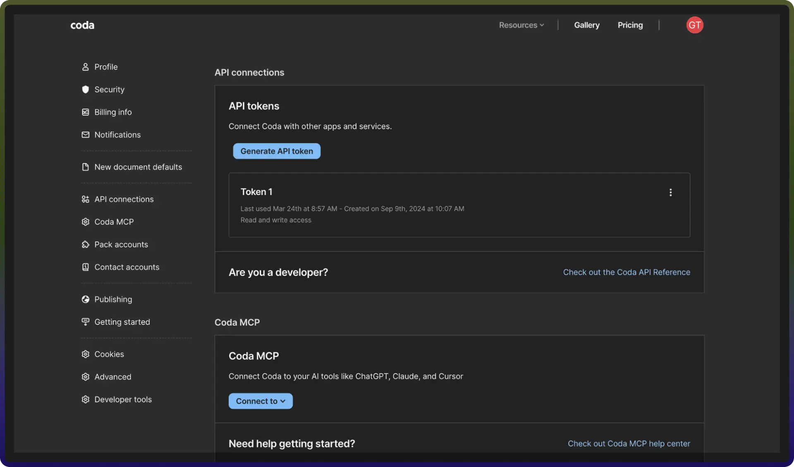

# Coda connector

Source: https://www.unifyapps.com/docs/unify-integrations/coda
Section: integrations

---

Coda streamlines document collaboration and workflow management by combining documents, spreadsheets, and applications into a single platform. This integration allows you to manage docs, tables, rows, and automations efficiently with real-time updates. 
 For a smooth integration process, ensure you have the following information ready:

## Authentication:

Connecting your application to Coda enables seamless document management, collaboration, and automation.

Before starting, ensure you have the following information:

- `Connection Name`**:** Choose a meaningful name for your connection. This name helps you identify the connection within your application or integration settings. It could be something descriptive like "MyAppCodaIntegration".
- `Authentication Type`**:** Coda supports API token-based authentication.

### Token Based :

1. Go to [https://coda.io/account](https://coda.io/account).
2. Navigate to API connections.
3. Add restrictions if necessary.
4. Click on generate API token.
5. Copy the generated token and store it securely.

## Actions **:**

| **Action Name** | **Description** |
|---|---|
| `Add permission` | Adds a new permission to the doc in Coda |
| `Create doc` | Creates a new doc in Coda |
| `Create page` | Creates a new page in doc in Coda |
| `Delete doc` | Delete doc using doc ID in Coda |
| `Delete page` | Delete a page in Coda |
| `Delete permission` | Delete a permission in Coda |
| `Get doc` | Get the doc using doc ID in Coda |
| `Get page` | Get a page in Coda |
| `Get table` | Returns a specific table in a doc in Coda |
| `Get user info` | Get user info in Coda |
| `List docs` | Returns a list of docs accessible by the user in Coda |
| `List pages` | Returns a list of pages in Coda |
| `List permissions` | Returns a list of permissions for the doc in Coda |
| `List tables` | Returns a list of tables in a doc in Coda |
| `Update doc` | Update a doc in Coda |
| `Update page` | Update a page in Coda |
