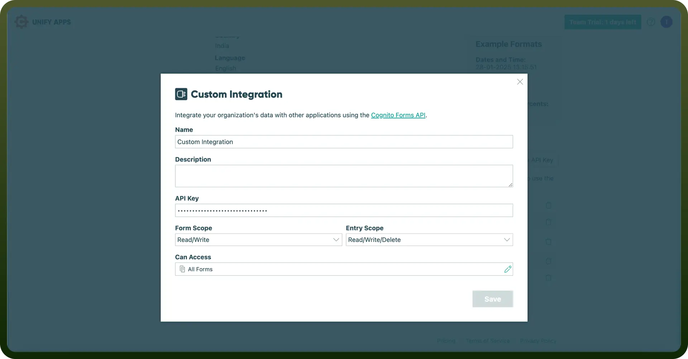

# Cognito Forms integration | connect with UnifyApps

Source: https://www.unifyapps.com/docs/unify-integrations/cognito-forms
Section: integrations

---

Cognito Forms is an intuitive online form builder that allows users to create powerful, customizable forms with advanced features like calculations, conditional logic, and payment integration. It helps streamline data collection and automate workflows efficiently.

Integrating your application with Cognito Forms enables you to collect and manage form data with ease.

## Authentication

Before you begin, make sure you have the following information:

- `Connection Name`**:** Choose a descriptive name for your connection, like "MyCognitoFormsIntegration." This helps in easily identifying the connection within your application or integration settings.
- `Authentication Type`: Cognito Forms supports API Key authentication. This method ensures secure access to your form data.

### API Key Based Authentication

- Log in to your Cognito Forms account and navigate to your Account Settings page.
- Under the API Keys section, click "`New API Key`" to generate a new key.
- Copy the generated API Key. Treat this key with high confidentiality, as it provides access to your form data.
- You can manage or regenerate your API key at any time from the Account Settings page.

  

## Actions

| Actions | Description |
|---|---|
| `Create entry` | Creates entry in Cognito Forms |
| `Delete entry by ID` | Deletes entry by ID in Cognito Forms |
| `Get entry by ID` | Gets entry by ID from Cognito Forms |
| `List forms` | Lists forms from Cognito Forms |
| `Set form availability by ID` | Sets form availability by ID from Cognito Forms |
| `Update entry` | Updates entry in Cognito Forms |
