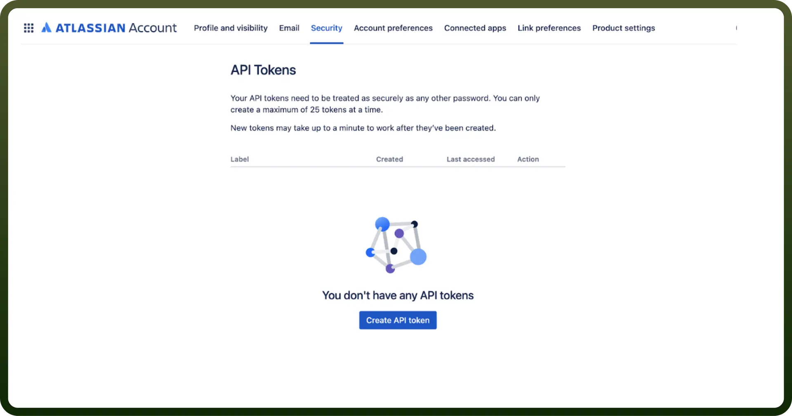
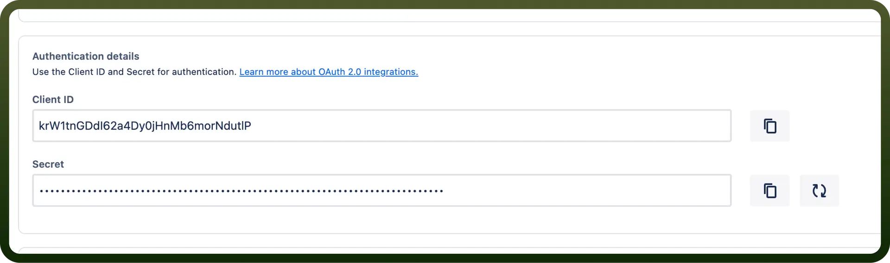

# Confluence connector

Source: https://www.unifyapps.com/docs/unify-integrations/confluence
Section: integrations

---

Confluence is a team collaboration tool by Atlassian that enables users to create, share, and organize documents in one centralized workspace. It streamlines project management and fosters transparency with customizable pages, real-time editing, and integrations.

Integrating your application with Confluence revolutionizes team collaboration, offering centralized knowledge sharing, document management, and workflow streamlining.

## Authentication

Ensure you have the following information ready for a seamless integration process:

- `Connection Name`: Select a descriptive name for your connection, like "MyAppConfluenceIntegration". This helps in easily identifying the connection within your application or integration settings.
- `Authentication Type`: Select the type of authentication for connecting to your confluence account:
  - OAuth
  - API token
- `Confluence Domain`**:** Enter your Confluence domain name. This can be found in your Confluence URL (e.g.,example.atlassian.net).

### Token-based Authentication

**How to get API Token:**

- Create the API token by going to [https://id.atlassian.com/manage/api-tokens](https://id.atlassian.com/manage/api-tokens).
- In the API token section, click on "`Create API token`." Ensure to keep this key secure as it grants access to Confluence's services and is billed based on usage.

  

### OAuth 2.0 Authentication

- `Client ID`**:** Enter your Client ID. To learn how to create a client ID and client secret, follow the official [Confluence documentation](https://confluence.atlassian.com/confkb/oauth-2-0-configuration-for-confluence-1224638905.html).
- `Client Secret`**:** Enter your Client Secret, located below the Client ID.

  

## Actions

| Actions | Description |
|---|---|
| `Create blog post` | Creates a blog post in Confluence |
| `Create page` | Create a page in Confluence |
| `Create task` | Create task in Confluence |
| `Get blog post details` | Gets blog post details from a Confluence space |
| `Get current user` | Get current user details |
| `Get page details` | Gets page details from a Confluence space |
| `List blog posts` | List blog posts in a space |
| `List pages` | List pages in a space |
| `List user groups` | Get a list of groups that a user belongs to |
| `Search pages` | Search for pages in Confluence |
| `Update page` | Updates a page in Confluence |
