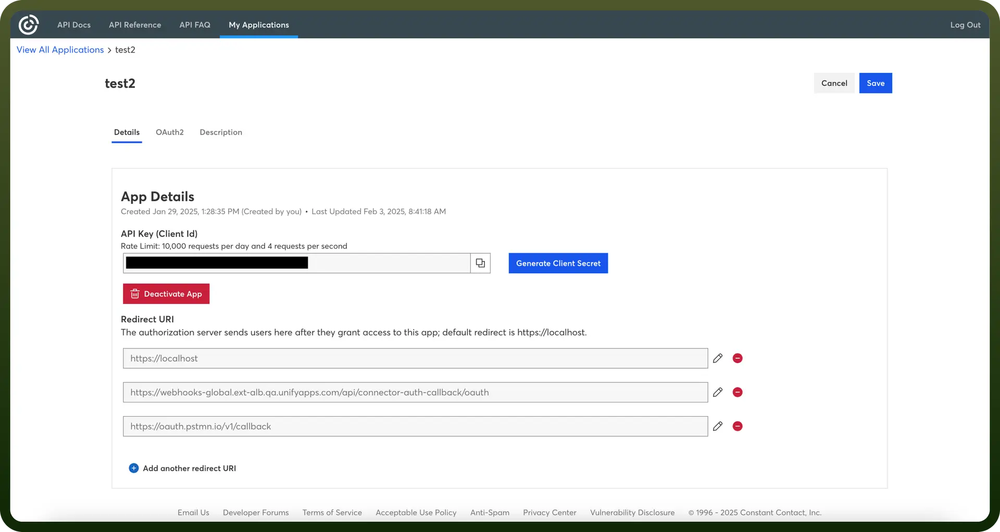

# Constant Contact integration | connect with UnifyApps

Source: https://www.unifyapps.com/docs/unify-integrations/constant-contact
Section: integrations

---

Constant Contact is an email marketing platform that helps businesses create, send, and track professional email campaigns. It offers automation, contact management, and analytics to improve audience engagement and marketing effectiveness.

Integrating your application with Constant Contact enables efficient email marketing, contact management, and campaign tracking.

## Authentication

Before you begin, make sure you have the following information:

- `Connection Name`**:** Choose a descriptive name for your integration. For example, "MyAppConstantContactIntegration" will help you easily identify the connection within your application or integration settings.
- `Authentication Type`**:** Constant Contact uses OAuth 2.0 for secure authentication and authorization.

### OAuth Based Authentication

1. Register as a [Constant Contact Developer](https://developer.constantcontact.com/api_guide/server_flow.html).
2. Log in to your Constant Contact account and navigate to the Developer section in the menu.
3. Click “`Create an App`” to start creating your integration.
4. After registering your app, you will receive an `API Key` and `API Secret` for use in your application.
5. Once your app is created, locate your Client ID and Client Secret in the Constant Contact Developer Dashboard.

  

6. Copy the `Client ID` and `Client Secret` for use in your application's integration setup.
7. Keep these credentials secure to prevent unauthorized access.

## Actions

| Actions | Description |
|---|---|
| `Add contact to lists` | Adds a contact to one or more lists in Constant Contact |
| `Create contact` | Create a new contact in Constant Contact |
| `Find contact` | Find contact by email address in Constant Contact |
| `Remove contact from list` | Removes a contact from a list in Constant Contact |
| `Tag contact` | Add one or more tags to a contact in Constant Contact |
| `Update contact` | Updates a contact in Constant Contact |

## Triggers

| Triggers | Description |
|---|---|
| `New contact` | Triggers when a new contact is added to your account in Constant Contact |
| `New email open` | Triggers when a recipient opens an email from a specified campaign activity in Constant Contact |
| `New list` | Triggers when a new list is added in Constant Contact |
| `New unsubscriber` | Triggers when a contact unsubscribes (Email Unsubscribed) in Constant Contact |
