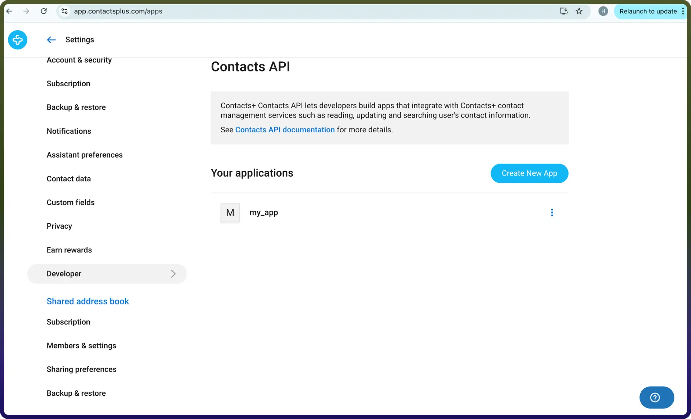

# Contactplus connector

Source: https://www.unifyapps.com/docs/unify-integrations/contactplus
Section: integrations

---

Integrating your application with Contacts+'s REST API allows seamless access to contact management, synchronization and automation features. Before starting the integration process, ensure you have the following details:

## Authentication

Connecting your application to Contacts+ allows you to automate and manage your contacts effectively. Make sure you have the following information ready:

- `Connection Name`: Choose a unique and meaningful name for your connection. This name helps identify the connection within the UnifyApps platform, such as 'ContactsplusIntegration'.
- `Authentication Type`: Connecting your application to Contacts+ requires **OAuth-based** authentication.

## OAuth-Based Authentication :

1. Log in to your Contacts+ account.
2. Navigate to the **Developer** section under **Settings**.
3. Locate your application. If you do not have an application created, you will need to create one first.
4. Once the application is created, you will be provided with a **Client ID** and **Client Secret.** Copy the Client Secret immediately, as it may not be visible again after you leave the page.
5. Ensure that your application is configured with the correct **redirect URLs** and required permissions.
6. Use the Client ID and Client Secret to complete the OAuth authentication flow during setup.
7. A screenshot of the webpage where you can find the above details is provided below for reference:

  

## Actions **:**

| **Action Name** | **Description** |
|---|---|
| `Create contact` | Creates a new contact in Contacts+ |
| `Create tag` | Creates a new tag in Contacts+ |
| `Delete contact` | Deletes a contact from Contacts+ |
| `Delete tag` | Deletes a tag from Contacts+ |
| `Edit tag` | Edits a tag in Contacts+ |
| `Get account details` | Fetches the authenticated user’s account information including name, photo, emails and more from Contacts+ |
| `Get contacts` | Returns a list of contacts from Contacts+ |
| `Get contacts by IDs` | Retrieves one or more contacts by contact IDs from Contacts+ |
| `Get tags` | Returns a list of tags from Contacts+ |
| `Get tags by IDs` | Retrieves one or more tags by tag IDs from Contacts+ |
| `Get teams` | Gets list of teams that the user is a member of in Contacts+ |
| `Manage tags` | Adds or removes tags from multiple contacts in Contacts+ |
| `Search contacts` | Searches contacts by name, company, email, phone, or any combination in Contacts+ |
| `Update contact` | Updates an existing contact in Contacts+ |
| `Upload contact photo` | Adds a new photo to a contact, making it the default profile photo in Contacts+ |

## Triggers :

| **Trigger Name** | **Description** |
|---|---|
| `On create contact` | Triggers when a new contact is created on Contacts+ |
| `On create tag` | Triggers when a new tag is created on Contacts+ |
| `On delete contact` | Triggers when a contact is deleted on Contacts+ |
| `On delete tag` | Triggers when a tag is deleted on Contacts+ |
| `On update contact` | Triggers when a contact is updated on Contacts+ |
| `On update tag` | Triggers when a tag is updated on Contacts+ |
