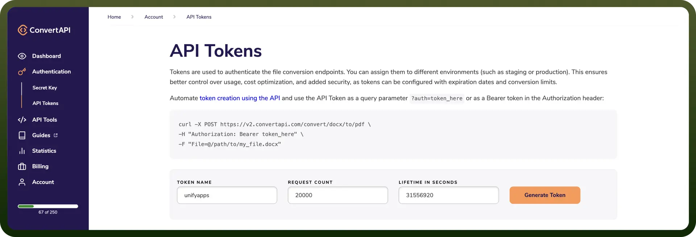

# ConvertAPI connector

Source: https://www.unifyapps.com/docs/unify-integrations/convertapi
Section: integrations

---

ConvertAPI is a file conversion API that enables converting documents (PDF, Word, Excel, images, etc.) into various formats programmatically. It supports over 200 formats and offers simple REST-based integration.

Automates document processing and format conversion, saving time and ensuring consistency across workflows.

## Authentication

Before you begin, make sure you have the following information:

- `Connection Name`: Choose a descriptive name for your connection, such as "`MyAppConvertAPIIntegration`" to easily identify it within your application settings.
- `Authentication Type`**:** ConvertAPI supports API Tokens for authentication.

### API Token Based Authentication

- Log in to your ConvertAPI account.
- Navigate to `Authentication` > `API Tokens`.
- Click on `Generate Token`, provide a name, and configure request limits if needed.
- Keep your API token secure, as it grants access to ConvertAPI services.

## Actions Supported

| Actions | Description |
|---|---|
| `Convert Images to PDF` | Converts Images into PDF format |
| `Convert PDF to DOC` | Converts PDF file into DOC file |
| `Convert PDF to PDF/A` | Converts PDF file into PDF/A file |
| `Convert PDF to PNG` | Converts PDF file into PNG file |
| `Convert PDF to PPTX` | Converts PDF file into PPT file |
| `Convert WEB to JPG` | Converts WEB page into JPG format |
| `Convert WEB to PDF` | Converts WEB page into PDF format |
| `Convert WEB to PNG` | Converts WEB page into PNG format |
| `Converts email files to pdf` | Converts email files (MSG, EML) to a PDF file |
| `Converts office files to pdf` | Converts office files (DOCX, XLSX, PPTX) to a PDF file |
