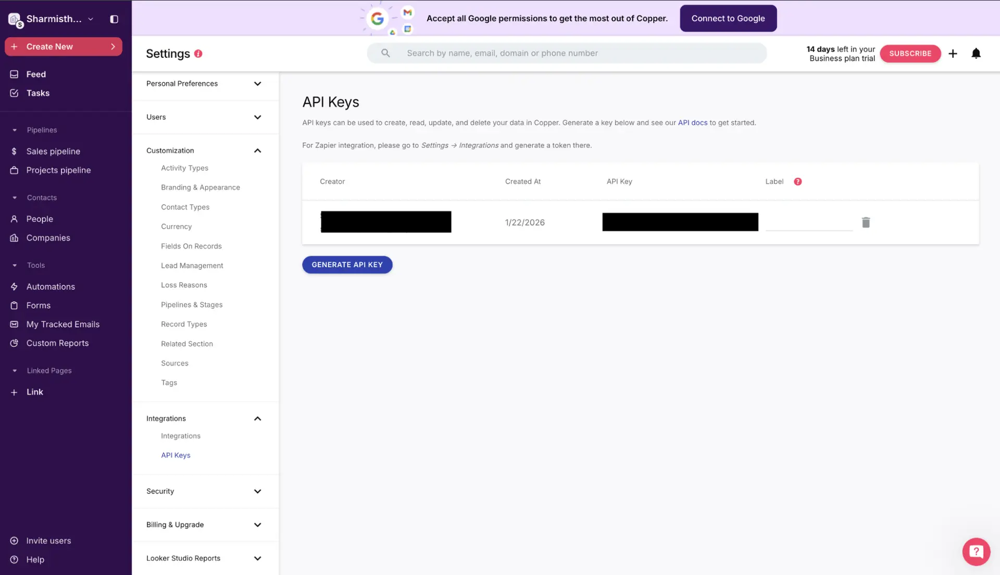

# Copper CRM Integration

Source: https://www.unifyapps.com/docs/unify-integrations/copper-crm
Section: integrations

---

## **Copper**

Copper is a customer relationship management (CRM) platform designed to work seamlessly with Google Workspace. It helps teams manage leads, people, companies, and opportunities directly from familiar Google tools, improving sales productivity and relationship tracking.

### Authentication :

Before you begin, make sure you have the following information:

- `Connection Name`: Choose a meaningful name for your connection. This name helps you identify the connection within your application or integration settings, such as MyAppCopperIntegration.
- `Developer API`: This value is fixed as developer_api and should not be changed.
- `Email`: The email address associated with your Copper user account.

### API Key–Based Authentication :

1. Log in to your Copper CRM account.
2. Click the Settings icon in the top-right corner.
3. Navigate to Integrations.
4. Select API Keys.
5. Click Generate API Key.
6. Copy the generated API key and store it securely.
7. Use this generated token for authentication purposes.

### ACTIONS :

| **Action Name** | **Description** |
|---|---|
| `Create activity` | Creates a new activity in Copper |
| `Create company` | Creates a new company in Copper |
| `Create lead` | Creates a new lead in Copper |
| `Create opportunity` | Create a new opportunity in Copper |
| `Create person` | Creates a new person in Copper |
| `Delete activity` | Deletes an activity in Copper |
| `Delete company` | Deletes a company in Copper |
| `Delete lead` | Deletes a lead in Copper |
| `Delete opportunity` | Delete an opportunity in Copper |
| `Delete person` | Deletes a person in Copper |
| `Get activity` | Gets  activity details by ID from Copper |
| `Get company` | Get company details from Copper |
| `Get lead` | Gets lead details from Copper |
| `Get opportunity` | Get opportunity details by ID from Copper |
| `Get person` | Get person details from copper |
| `Get user` | Get user details from Copper |
| `Search activities` | Search activities in Copper |
| `Search opportunities` | Search opportunities in Copper |
| `Search companies` | Searches for companies in Copper |
| `Search leads` | Search leads in Copper |
| `Search people` | Searches for  people in Copper |
| `Search users` | Search for users in Copper |
| `Update activity` | Updates an activity in Copper |
| `Update company` | Updates a company in Copper |
| `Update lead` | Updates a lead in Copper |
| `Update opportunity` | Updates an opportunity in Copper |
| `Update person` | Updates a person in Copper |
| `Upsert lead` | Upserts a lead in Copper |
|  |  |

**Triggers**

| **Trigger Name** | **Description** |
|---|---|
| **Delete activity** | Triggers when an activity is deleted in Copper |
| **Delete company** | Triggers when a company is deleted in Copper |
| **Delete lead** | Triggers when a lead is deleted in Copper |
| **Delete opportunity** | Triggers when an opportunity is deleted in Copper |
| **Delete person** | Triggers when a person is deleted in Copper |
| **Delete project** | Triggers when a project is deleted in Copper |
| **Delete task** | Triggers when a task is deleted in Copper |
| **New activity** | Triggers when a new activity is created in Copper |
| **New company** | Triggers when a new company is created in Copper |
| **New lead** | Triggers when a new lead is created in Copper |
| **New opportunity** | Triggers when a new opportunity is created in Copper |
| **New person** | Triggers when a new person is created in Copper |
| **New project** | Triggers when a new project is created in Copper |
| **New task** | Triggers when a new task is created in Copper |
| **Update activity** | Triggers when an activity is updated in Copper |
| **Update company** | Triggers when a company is updated in Copper |
| **Update lead** | Triggers when a lead is updated in Copper |
| **Update opportunity** | Triggers when an opportunity is updated in Copper |
| **Update person** | Triggers when a person is updated in Copper |
| **Update project** | Triggers when a project is updated in Copper |
| **Update task** | Triggers when a task is updated in Copper |
