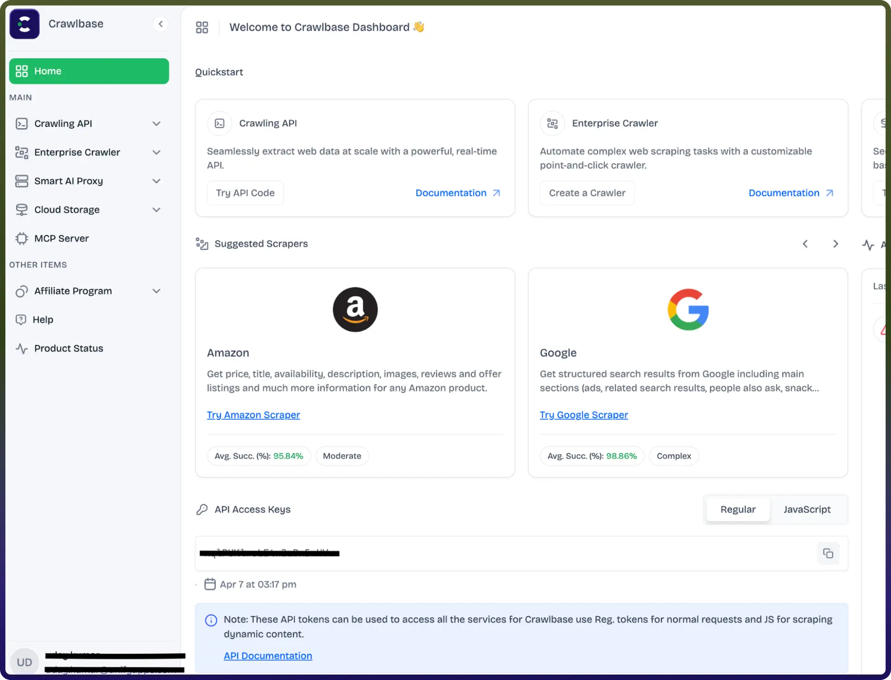

# Crawlbase connector

Source: https://www.unifyapps.com/docs/unify-integrations/crawlbase
Section: integrations

---

Integrating your application with Crawlbase elevates your data strategy by enabling reliable web crawling at scale, bypassing anti-bot protections, and delivering structured, real-time data—while ensuring high performance, anonymity, and enterprise-grade reliability.

## Authentication:

Crawlbase integration provides reliable, scalable web crawling. It bypasses anti-bot protections to deliver structured, real-time data with high performance, anonymity, and enterprise reliability, enhancing data strategy. Before you begin, ensure you have the following information:

`Connection Name :` Choose a meaningful name for your connection. This name helps you identify the connection within your application or integration settings. It could be something descriptive like "MyAppCrawlbaseIntegration".
`Authentication Type:` Crawlbase supports API Token Based Authentication method

### API Token Based:

1. Log in to your Crawlbase account [here](https://crawlbase.com/login).
2. From the [dashboard](https://crawlbase.com/dashboard), click on **Overview** in the top-left corner.
3. Navigate to and create the API access Keys.
4. Create new api keys in the regular tab and store them securely for authentication purposes.

## Actions

| **Action Name** | **Description** |
|---|---|
| `Crawl website content` | Crawl website content using Crawlbase API |
| `Scrape website content` | Scrape website content using Crawlbase Scraper API |
