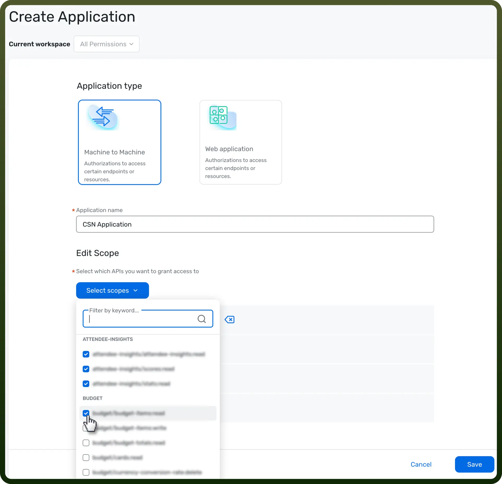
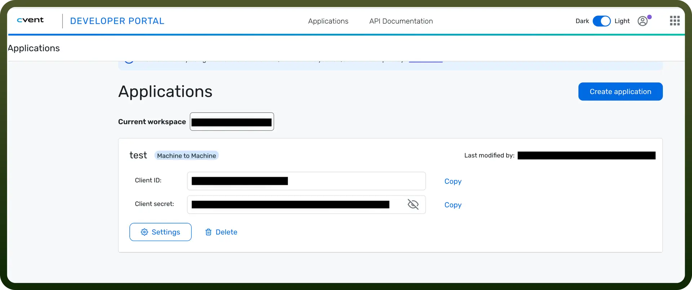

# Cvent connector

Source: https://www.unifyapps.com/docs/unify-integrations/cvent
Section: integrations

---

Cvent is an event management platform that streamlines event planning, registration, and attendee engagement. It offers powerful tools for managing in-person, virtual, and hybrid events, providing automation, analytics, and seamless integrations.

Integrating Cvent enhances event planning efficiency, improves attendee experiences, and offers robust data-driven insights, enabling organizations to manage events at scale with minimal manual

### Authentication

Ensure you have the following information ready for a seamless integration process:

- `Connection Name`**:** Choose a meaningful name for your connection. This name helps you identify the connection within your application or integration settings. It could be something descriptive like "MyAppCventIntegration".
- `Authentication Type`**:** Select the type of authentication for connecting to your Cvent account:
  - OAuth 2.0

### OAUTH 2.0 Authentication

1. To get permission to use OAuth 2.0 authentication with your app, contact Cvent.
2. If you haven't worked with CSN APIs, Cvent will create you a workspace with the CSN scopes enabled. [Invite your developer](https://developers.cvent.com/docs/rest-api/inviting-your-developers) and give them access to the created workspace.
3. Sign in and create an application.
4. Click `Settings` on the application and add the `CSN scopes`. Then click `Save`.

  

5. Once you've created your application, use the application's client credentials to make an authorization call.
6. Store the credentials in a secure location as they provide access to your cvent account.

  

## Actions

| Actions | Description |
|---|---|
| `Create a new contact` | Creates a new contact in Cvent |
| `Create an appointment` | Creates an appointment in Cvent |
| `Create an attendee` | Creates an attendee in Cvent |
| `Create an audience segment` | Creates an audience segment in Cvent |
| `Create an event` | Creates an event in Cvent |
| `Delete a contact` | Deletes a contact in Cvent |
| `Find a contact` | Finds a contact in Cvent |
| `Find an appointment` | Finds an appointment in Cvent |
| `Find an attendee` | Finds an attendee in Cvent |
| `Find an audience segment` | Finds an audience segment in Cvent |
| `Find an event` | Finds an event in Cvent |
| `Update a contact` | Updates a contact in Cvent |
| `Update an attendee` | Updates an attendee in Cvent |
| `Update an event` | Updates an event in Cvent |
