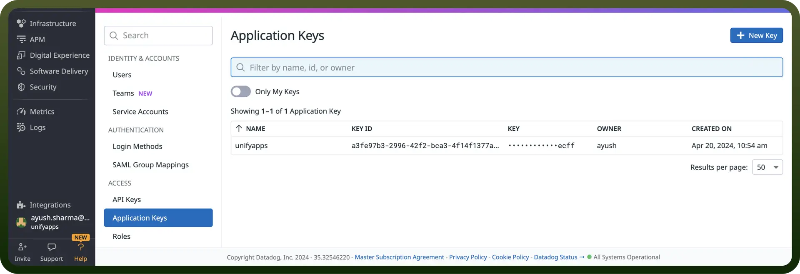
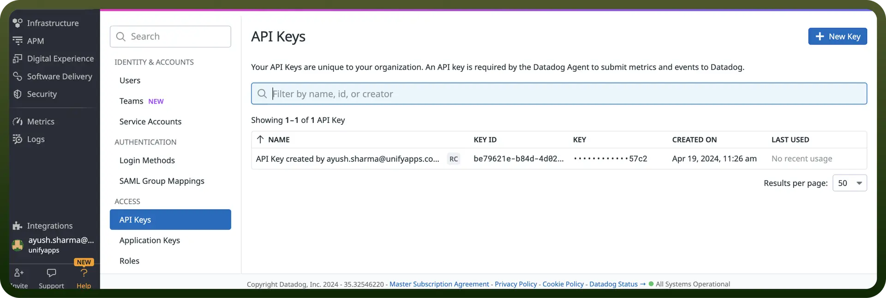

# Datadog connector

Source: https://www.unifyapps.com/docs/unify-integrations/datadog
Section: integrations

---

Datadog is a cloud-based monitoring and analytics platform that provides real-time insights into applications, infrastructure, and logs across various environments. It enables teams to track performance, troubleshoot issues, and enhance operational efficiency through customizable dashboards and alerts.

Integrating your application with Datadog elevates monitoring and analytics, providing real-time insights into system performance, security, and operational efficiency.

## Authentication

Ensure you have the following information ready for a seamless integration process:

- `Connection Name`**:** Select a descriptive name for your connection, like "MyAppDatadogIntegration". This helps in easily identifying the connection within your application or integration settings.
- `Authentication Type`**:** Datadog supports Access Token for authentication. This method ensures secure access to Datadog’s functionalities and data.
- **Access Token:**
  - Login into your Datadog account. Navigate to the Profile icon on the bottom left corner of the page.
  - Click on the Organization setting. Now to get the API Key, click on the “`API Keys`” present in the left navigation pane.
  - In the API key section, click on “`New Key`” button and provide the name to the key and click “`create key`” to create the API Key.

    

  - To get the Application key, click on “`Application Key`” present in the left navigation pane of the organization setting.
  - In the Application Key section, click on the “`New Key`” button and provide the name to the key and click “`create key`” to create the Application key.
  - Upon creation of the Application key, provide the required scope to the key by clicking on the name of the application key.

    

## Actions

| **Action Name** | **Description** |
|---|---|
| `Check if monitor can be deleted` | Check if monitor can be deleted from Datadog |
| `Create event` | Creates an event in Datadog |
| `Create monitor` | Creates a monitor in Datadog |
| `Create user` | Creates a user in Datadog |
| `Delete monitor` | Deletes a monitor from Datadog |
| `Disable user` | Disables a user in Datadog |
| `Get event` | Gets an event from Datadog |
| `Get metric metadata` | Gets metadata for a metric from Datadog |
| `Get monitor` | Gets monitor details from Datadog |
| `Get role` | Gets a role from Datadog |
| `Get user` | Gets a user from Datadog |
| `Get user permissions` | Gets permissions of a user from Datadog |
| `List active metrics` | Lists active metrics from Datadog |
| `List monitors` | Lists all monitors in Datadog |
| `List permissions` | Lists permissions from Datadog |
| `List role permissions` | Lists role permissions from Datadog |
| `List role users` | Lists role users from Datadog |
| `List roles` | Lists roles from Datadog |
| `List users` | Lists all users from Datadog |
| `Mute monitor` | Mutes a monitor from Datadog |
| `Query events` | Retrieves events from Datadog |
| `Query timeseries points` | Retrieves timeseries points from Datadog |
| `Remove user from role` | Removes a user from a role in Datadog |
