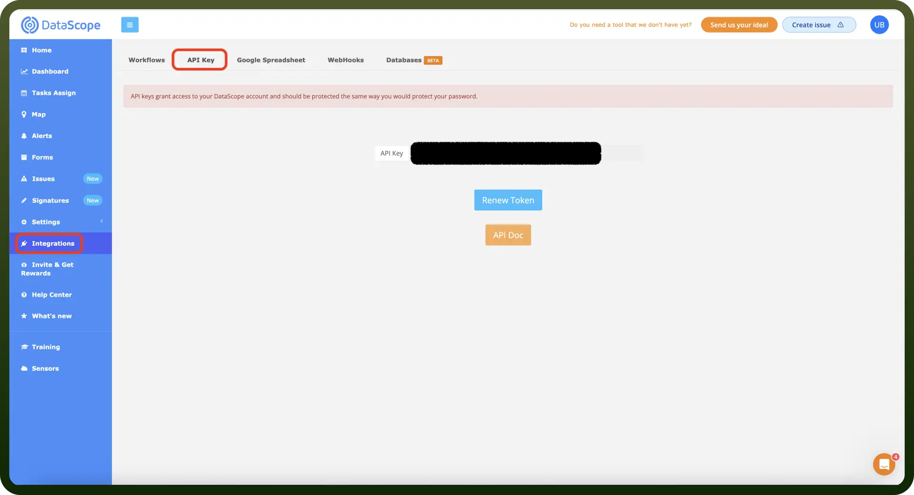

# DataScope connector

Source: https://www.unifyapps.com/docs/unify-integrations/datascope
Section: integrations

---

Integrating DataScope allows businesses to digitize workflows and automate data collection in real-time. It improves field team efficiency, ensures data accuracy, and enables instant reporting from mobile to dashboard.

Integrating DataScope streamlines data collection and task management, boosting accuracy and operational efficiency.

## Authentication

Before you begin, make sure you have the following information:

- `Connection Name`: Select a descriptive name for your connection, like "MyAppDataScopeIntegration". This helps in easily identifying the connection within your application or integration settings.
- `Authentication Type`**:** DataScope supports API Key authentication.

### API Key Based Authentication

- Log into your DataScope account and navigate to the "`Integrations`" section from the sidebar.
- In the "`API Key`" tab, you will find your API Key.
- You can also renew API Key by clicking on "`Renew Token`".
- Copy the API Key and keep it secure, as it grants access to your DataScope account.

  

## Actions

| Actions | Description |
|---|---|
| `Assign task` | Creates a new task assigned to specific form and user in DataSource |
| `Get all form answers with metadata` | Retrieves all form answers with metadata in DataScope |
| `Get all locations` | Retrieves all locations in DataScope |
| `Modify form answer` | Changes form answer in DataScope |

## Triggers

| Triggers | Description |
|---|---|
| `New form answer entry` | Triggers when a new form answer entry is created in DataScope |
