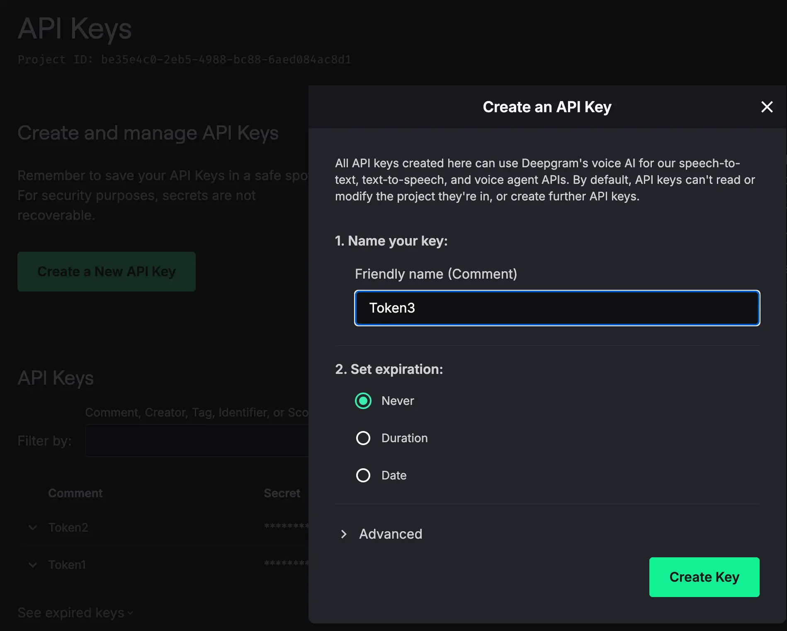
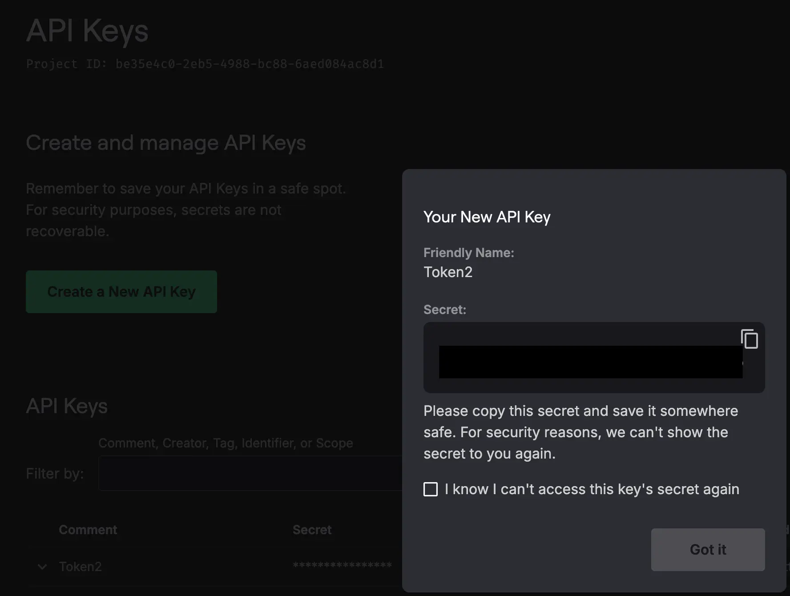

# Deepgram Integration

Source: https://www.unifyapps.com/docs/unify-integrations/deepgram
Section: integrations

---

# Deepgram

Deepgram enables teams to integrate cutting-edge speech-to-text and audio intelligence using advanced AI models for real-time transcription, diarization, sentiment analysis, and voice analytics. With a strong focus on accuracy, low latency, and enterprise scalability, Deepgram helps organizations build intelligent voice applications that enhance customer interactions, automate call processing, and unlock insights from audio data through secure, high-performance API integrations.

### Authentication

Integrating your application with Deepgram enables seamless audio transcription, real-time voice processing, and intelligent conversation analytics workflows. Before starting, ensure you have the following information:

`Connection Name` : Choose a meaningful name for your connection. This name helps you identify the connection within your application or integration settings. It could be something descriptive like “MyAppDeepgramIntegration”.

#### Access API Key :

- Go to the Deepgram console and sign in with your account.
- In the left-hand menu of the Deepgram Console, click API Keys.
- Click on the Create API Key button.
- Enter a name to help you identify this key.
- Choose whether the key should never expire, or set a duration/date if required.
- Copy the generated API key.
- Once created, copy the generated API key and use it for further authentication purposes.

### **ACTIONS :**

| **Action Name** | **Descriptions** |
|---|---|
| `Speech to text` | Converts speech to text in Deepgram |
| `Text to speech` | Converts text to speech in Deepgram |
| `Text to speech Realtime` | Converts text to speech in realtime in Deepgram |
| `Send Control Text to Realtime Session` | Send control text to speech in realtime in Deepgram |
| `Send Text to Realtime Session` | Sends text to speech in realtime in Deepgram |
