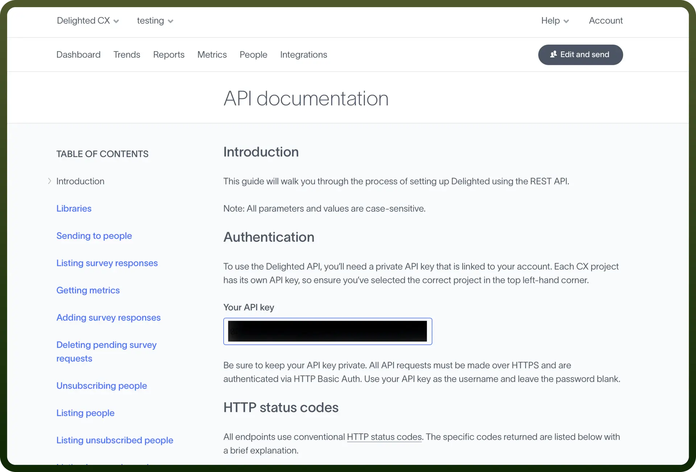

# Delighted connector

Source: https://www.unifyapps.com/docs/unify-integrations/delighted
Section: integrations

---

Delighted.com is an experience management platform that enables businesses to collect and analyze customer feedback effortlessly, offering various survey templates and seamless integrations. It serves brands worldwide, providing actionable insights to enhance customer satisfaction and loyalty.

Integrating Delighted.com helps businesses gather real-time customer feedback, enabling data-driven decisions to improve satisfaction and loyalty.

## Authentication

Before you begin, make sure you have the following information:

1. `Connection Name`**:** Select a descriptive name for your connection, like "MyAppDelightedIntegration". This helps in easily identifying the connection within your application or integration settings.
2. `Authentication Type`**:** Delighted provides API based authentication.

### API Based Authentication

1. First, create an account or sign up on Delighted. In the dashboard, there will be an option for integration .
2. Click on it, and then select the API option.
3. You will find an API key under the authentication section.

  

4. To use the Delighted API, you need a private API key linked to your account. Use your API key as the username and leave the password blank.
5. All API requests must be made over HTTPS and authenticated via HTTP Basic Auth.

## Actions

| Actions | Description |
|---|---|
| `Add person` | Creates a person in Delighted |
| `Add survey response` | Adds a survey response in Delighted |
| `Get metrics` | Retrieves metrics for your account in Delighted |
| `List people` | Retrieves all people for your account in Delighted |
| `Send Email survey` | Sends an Email platform survey in Delighted |
| `Send SMS survey` | Sends an SMS platform survey in Delighted |
| `Unsubscribe person` | Adds a person to your unsubscribe list in Delighted |

## Triggers

| Triggers | Description |
|---|---|
| `New response` | Triggers when a new response is received in Delighted |
| `New unsubscribe` | Triggers when a new person unsubscribes in Delighted |
