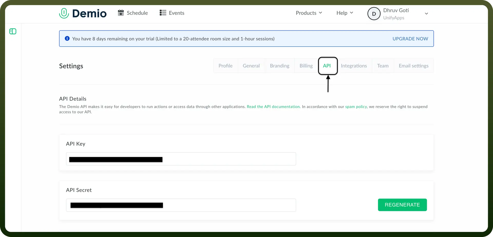

# Demio connector

Source: https://www.unifyapps.com/docs/unify-integrations/demio
Section: integrations

---

Demio is a browser-based webinar platform designed for marketers to host live, automated, and on-demand events. It offers engagement tools, analytics, and integrations to enhance audience interaction and lead generation.

Integrating your application with Demio streamlines webinar management, enabling seamless scheduling, engagement, and audience tracking in real-time.

## Authentication

Before you begin, make sure you have the following information:

- `Connection Name`**:** Choose a meaningful name for your connection. This name helps you identify the connection within your application or integration settings. It could be something descriptive like "MyAppDemioIntegration".
- `Authentication Type`**:** Demio supports BASIC authentication, requiring an Api-Key and Api-Secret.

### API Key Based Authentication

- Access `Api-Key` and `Api-Secret`:
  - Log into your Demio account.
  - Click Your Profile Name and then Settings.
  - Click on `API`.
  - Click on `REGENERATE`.

    

## Actions

| Actions | Description |
|---|---|
| `Create registration` | Creates new registration for an event in Demio |
| `Get event list` | Get list of events in Demio |
| `Get event session` | Get event session information in Demio |
| `Get list of event session` | Get list of event sessions in Demio |

## Triggers

| Triggers | Description |
|---|---|
| `Did not attend webinar` | Triggers when a webinar ends, and registrant is absent in Demio |
| `On joining webinar` | Triggers when a registrant joins a running webinar in Demio |
| `On new registration` | Triggers when there is a new registration for a webinar in Demio |
| `On webinar update` | Triggers after a webinar has ended. If using a series webinar, provides the date of the next scheduled series in Demio |
