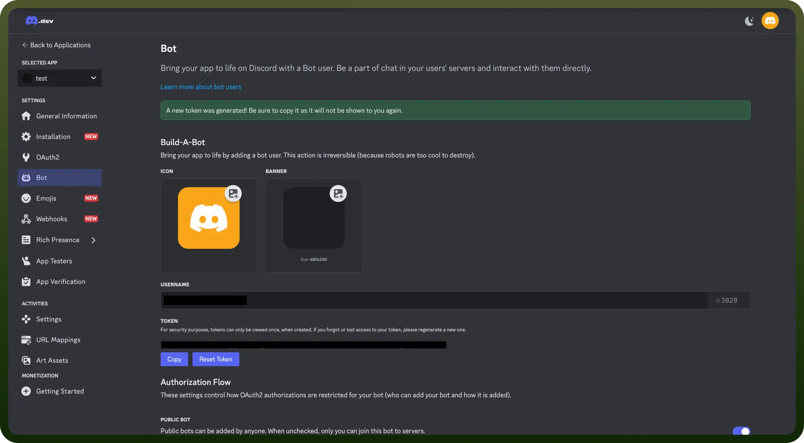

# Discord connector

Source: https://www.unifyapps.com/docs/unify-integrations/discord
Section: integrations

---

Discord integration enhances your application by enabling efficient channel management, messaging, and invites, leading to improved communication and user engagement.

Connecting your application to Discord enhances functionality and communication. With Discord’s API, you can manage channels, messages, and invites.

## Authentication

Before you begin, ensure you have the required information.

- `Connection Name`**:** Choose a meaningful name for your connection. This name helps you identify the connection within your application or integration settings. It could be something descriptive like "MyAppDiscordIntegration"
- `Authentication Type`**:** Select the type of authentication for connecting to your Discord account:
  - Bot token

### Bot Token Based Authentication

1. Visit the [Discord Developer Portal](https://discord.com/developers/applications)and log in with your Discord account. For more information on bots see [bots vs user accounts.](https://discord.com/developers/docs/topics/oauth2#bot-vs-user-accounts)
2. Click `New Application` and provide a name for your application.
3. Navigate to the `Bot` tab and click `Add Bot` to create a new bot for your application.
4. Under `TOKEN`**,** click `Reset Token` to generate your bot token.
5. Copy and securely store the bot token to prevent unauthorized access.

  

## Actions

| **Action** | **Description** |
|---|---|
| `Create channel invite` | Creates channel invite in Discord |
| `Create channel` | Creates channel in Discord |
| `Delete channel invite` | Deletes channel invite in Discord |
| `Delete channel` | Deletes channel in Discord |
| `Delete message` | Deletes message in Discord |
| `Send channel message` | Sends message to a channel in Discord |
| `Update channel message` | Updates channel message in Discord |
