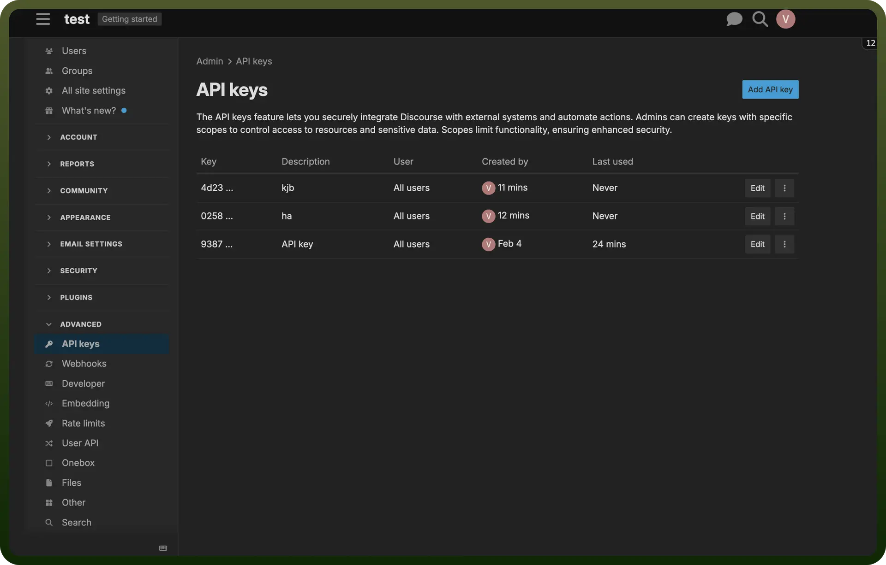

# Discourse connector

Source: https://www.unifyapps.com/docs/unify-integrations/discourse
Section: integrations

---

Discourse is an open-source discussion platform built for creating dynamic, community-driven forums. It supports real-time conversations, moderation tools and seamless integrations for modern online communities.

Integrating Discourse enhances community engagement with real-time discussions, streamlined moderation and robust API support for custom workflows.

## Authentication

Before you begin, make sure you have the following information:

- `Connection Name`: Select a descriptive name for your connection, like "MyAppShopifyIntegration". This helps in easily identifying the connection within your application or integration settings.
- `Authentication Type`**:** Discourse supports API Key authentication.

## API Key Based Authentication

- Log into your Discourse account and navigate to the '`Admin`'-> '`API keys section`'.
- Click on '`Add API Key`', enter a description, and save it.
- Copy the API Key and keep it secure, as it grants access to your Discourse account.
- Your API Username is the same as your Discourse account Username.

  

## Actions

| Actions | Description |
|---|---|
| `Create post` | Creates a new post under a topic in Discourse |
| `Create topic` | Creates a new topic in Discourse |
| `Delete post` | Deletes a post under a topic in Discourse |
| `Delete topic` | Deletes a topic in Discourse |
| `Retrieve post` | Retrieves a post under a topic in Discourse |
| `Retrieve topic` | Retrieves a topic in Discourse |
| `Update post` | Updates a post under a topic in Discourse |

## Triggers

| Triggers | Description |
|---|---|
| `Post created` | Triggers when a post is created in Discourse |
