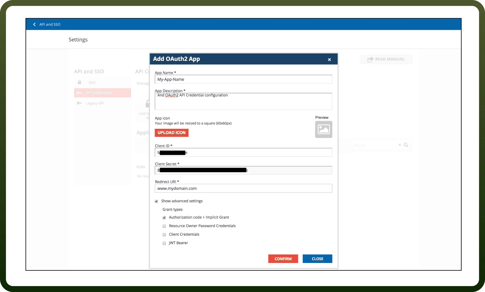

# Docebo connector

Source: https://www.unifyapps.com/docs/unify-integrations/docebo
Section: integrations

---

Docebo is an AI-powered learning management system (LMS) that enables enterprises to create, manage, and scale employee training programs. It offers automation, personalization, and analytics to enhance corporate learning experiences.

Integrating your application with Docebo allows you to automate learning management processes, synchronize data, and enhance user experiences through API-based authentication.

## Authentication

Before you begin, make sure you have the following information:

- `Connection Name`: Choose a meaningful name for your connection. This name helps you identify the connection within your application or integration settings. It could be something descriptive like 'MyAppDoceboIntegration'.
- `Authentication Type`: Select the type of authentication for connecting to your Docebo account:
  - OAuth based
  - JWT based

### OAuth based

- Log in to your Docebo Learn platform as an admin.
- Go to the `Admin Menu` and navigate to `API and SSO` and then `Manage`.
- Click on the `API Credentials` tab and select `Add OAuth2 App`.
- Provide a name and description for your OAuth2 application.
- After saving, your `Client ID` and `Client Secret` will be generated.
- Set the `Callback URL` (Redirect URI) under the application settings.
- Click `Confirm` to save the configuration. Refer [this](https://help.docebo.com/hc/en-us/articles/360020082060-APIs-authentication#h_01HJ6PBHP8FST1QVR8S56F3WAC) to learn more about Docebo OAuth 2.0.

### JWT based

- Log in to your Docebo Learn platform as an admin.
- Navigate to `API and SSO` and then `Manage`.
- Go to `API Credentials` and add a new OAuth2 app.
- Enable `JWT Bearer` as the authentication method.
- Retrieve the following details:
  - `Subdomain` : The subdomain of your Docebo account. For example, if your Docebo account URL is https://example.docebosaas.com, then the subdomain is 'example'.
  - `Username`: This should contain the username you want to use to log into the Docebo Learn platform.
  - `Client ID`: This should contain the Client ID configured inside the Docebo Learn platform for SSO. Refer [this](https://help.docebo.com/hc/en-us/articles/360020082060-APIs-authentication#h_01HJ6PBHP8FST1QVR8S56F3WAC) to learn more about Docebo JWT Authentication.

## Actions

| Actions | Description |
|---|---|
| `Create a classroom` | Creates a classroom in Docebo |
| `Create a course` | Creates a course in Docebo |
| `Enroll users` | Enroll users in courses in Docebo |
| `Delete a classroom` | Deletes a classroom by its ID in Docebo |
| `Delete a course` | Deletes a course by its ID in Docebo |
| `Un-enroll users` | Un-enroll users in courses in Docebo |
| `Get a classroom` | Gets a classroom by its ID in Docebo |
| `Get a course` | Gets a course by its ID in Docebo |
| `List certificates` | Lists certificates in Docebo |
| `List classroom` | Lists classroom in Docebo |
| `List instructors` | Lists all instructors assigned to a specific course in Docebo |
| `List survey data` | Lists survey data (questions, answers) grouped by user in Docebo |
| `Update a classroom` | Updates a classroom by its ID in Docebo |
