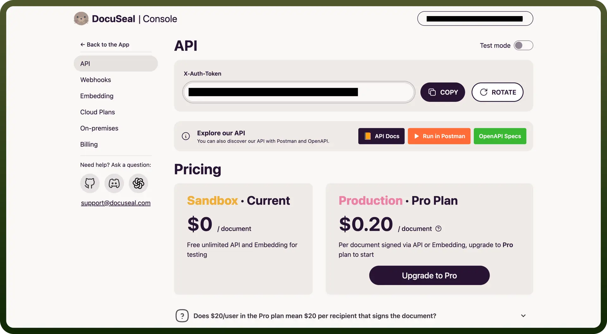

# DocuSeal connector

Source: https://www.unifyapps.com/docs/unify-integrations/docuseal
Section: integrations

---

DocuSeal is an open-source platform for creating, managing, and digitally signing PDF forms and documents. It streamlines document workflows by enabling secure e-signatures and automated data population.

Integrating DocuSeal automates document signing and form handling, saving time and ensuring legally compliant, tamper-proof workflows.

## Authentication

Before you begin, make sure you have the following information:

- `Connection Name`: Select a descriptive name for your connection, like "MyAppDocuSealIntegration". This helps in easily identifying the connection within your application or integration settings.
- `Authentication Type`**:** DocuSeal supports API tokens for authentication.

### API Key Based Authentication

- Log into your DocuSeal account and navigate to the top right section and click on your account icon.
- Click on `Profile` -> `API`
- Copy the API Key and keep it secure, as it grants access to your DocuSeal account.

## Actions

| Actions | Description |
|---|---|
| `Create signature request` | Create signature request in DocuSeal |

## Triggers

| Triggers | Description |
|---|---|
| `On Signing form completed` | Triggers when a signing form completed in Docuseal |
| `On submission form completed` | Triggers when a submission is completed by all parties in Docuseal |
