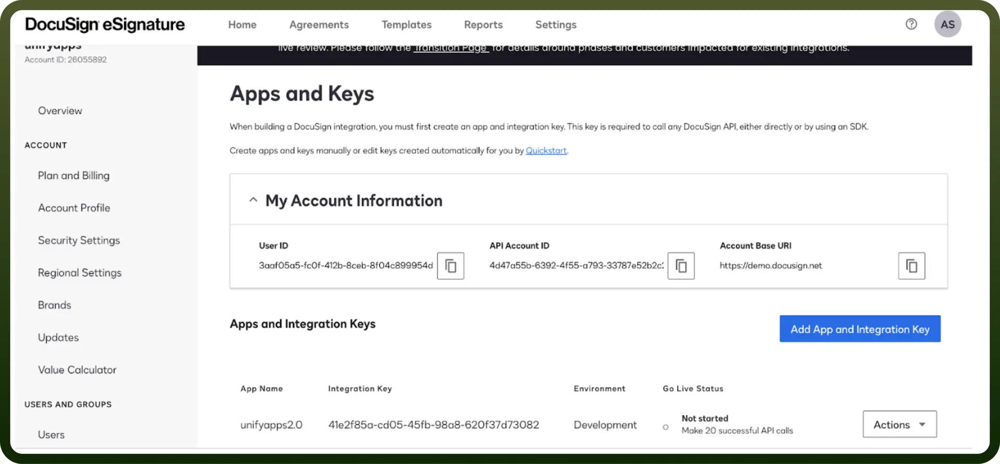

# DocuSign connector

Source: https://www.unifyapps.com/docs/unify-integrations/docusign
Section: integrations

---

DocuSign is a leading eSignature platform that enables users to sign, send, and manage documents digitally. It offers secure, legally binding signatures and seamless workflows to streamline agreements.

Integrating your application with DocuSign streamlines document management, facilitating secure and efficient e-signature workflows.

## Authentication

Before you begin, make sure you have the following information:

- `Connection Name`**:** Select a descriptive name for your connection, like "MyAppDocusignIntegration". This helps in easily identifying the connection within your application or integration settings.
- `Authentication Type`**:** Docusign supports Service Account for authentication.

### Service Account Based Authentication

- In the left navigation menu, click on “`Apps and Keys`” under the Integration section.
- In the apps and Key section, click on “`Add App and Integration Key`”.
  - In the Service integration section, click on “`Generate RSA`” to generate the Private key
  - Select the HTTP methods you want to use in your app.
- After creating the app, `Integration ID` is mapped to the app that has been created.
- `Account ID` will be available at the top left corner of the page.
- In the Apps and Key section you'll be able to find the `User ID` and `Domain` (i.e Account Base URL)

  

## Actions

| Actions | Description |
|---|---|
| `Create/Send document` | Creates/Sends a document in DocuSign |
| `Download document` | Downloads a document from DocuSign |
| `List documents in envelope` | Lists all the documents in an envelope in DocuSign |
| `Send document using template` | Sends a document using a template in DocuSign |

## Triggers

| Triggers | Description |
|---|---|
| `New click event` | Triggers when a new click event occurs in DocuSign |
| `New document event` | Triggers when a new document event occurs in DocuSign |
| `New document received` | Triggers when a new document is received in DocuSign |
| `New recipient event` | Triggers when a new recipient event occurs in DocuSign |
| `New template event` | Triggers when a new template event occurs in DocuSign |
