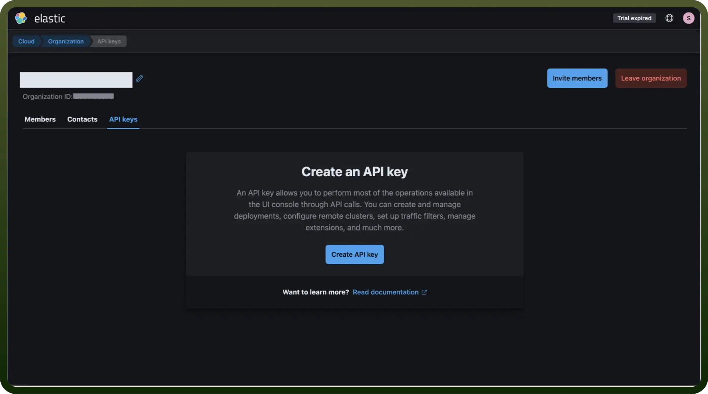
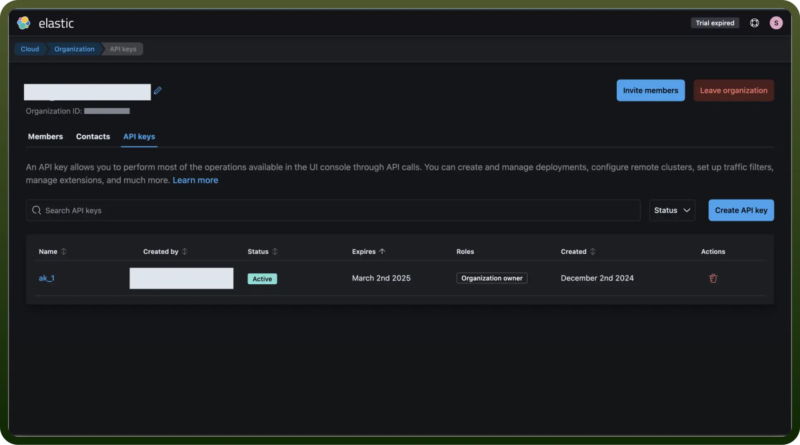

# Elastic Search

Source: https://www.unifyapps.com/docs/unify-integrations/elastic-search
Section: integrations

---

ElasticSearch is a versatile, open-source search and analytics suite built to deliver powerful search capabilities, insightful analytics, and real-time data processing. Designed for scalability and performance, it enables you to search, index, and analyze diverse datasets efficiently. Use ElasticSearch to gain actionable insights, enhance application search functionalities, and drive data-driven decisions with ease.

Integrating Elasticsearch with your application enables powerful search and analytics capabilities, allowing you to handle large datasets with lightning-fast performance.

## Authentication

Ensure you have the following information ready for a seamless integration process:

- `Connection Name`**:** Select a descriptive name for your connection, like "MyAppESIntegration". This helps in easily identifying the connection within your application or integration settings.
- `API Key`**:** Follow the steps given below to create an API Key for your ElasticSearch account
  - Log in to the [Elasticsearch Service Console](https://cloud.elastic.co/?page=docs&placement=docs-body).
  - Navigate to your avatar in the upper right corner and choose Organization.
  - On the API keys tab of the Organization page, click Create API Key. This key provides access to the API that enables you to manage your deployments. It does not provide access to Elasticsearch. To access Elasticsearch with an API key, create a key [in Kibana](https://www.elastic.co/guide/en/kibana/8.16/api-keys.html) or [using the Elasticsearch API](https://www.elastic.co/guide/en/elasticsearch/reference/8.16/security-api-create-api-key.html).

    

  - From the Create API Key page, you can configure your new key by adding a name, set expiration, or assign roles. To read more about the types of roles on Elasticsearch, [click here](https://www.elastic.co/guide/en/cloud/current/ec-user-privileges.html)
  - Click Create API key, copy the generated API key, and store it in a safe place.

    

## Actions

| Action | Description |
|---|---|
| `Analyze text` | Analyzes text string and returns resulting tokens in Elasticsearch |
| `ESQL Search query` | Returns search results for an ES|QL (Elasticsearch query language) query in Elasticsearch |
| `Make specified data stream or index searchable` | Adds a JSON document to the specified data stream or index and makes it searchable in Elasticsearch |
| `Return search hits that match the query` | Returns search hits that match the query defined in the request in Elasticsearch |
| `Elasticsearch API root` | Returns the basic build, version, and cluster information in Elasticsearch |
