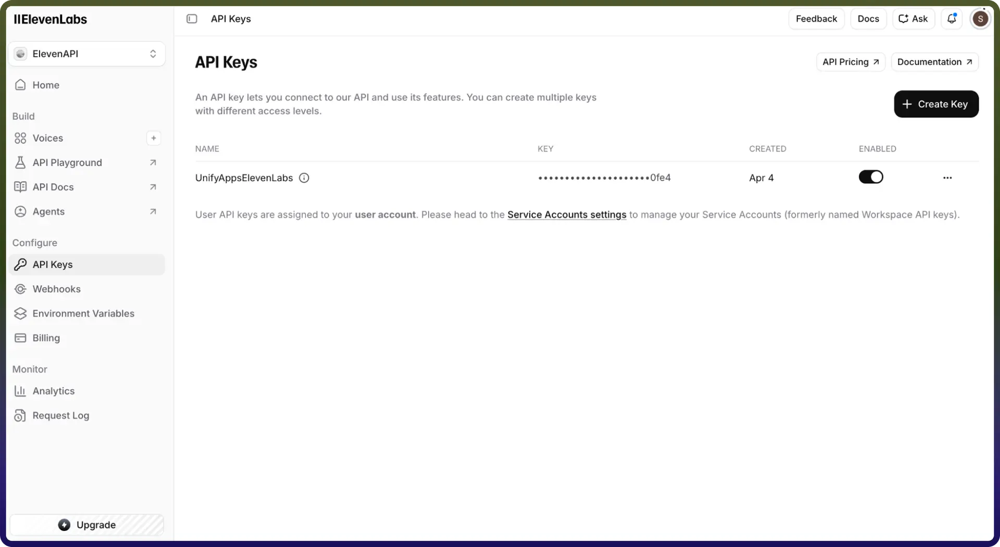

# ElevenLabs connector

Source: https://www.unifyapps.com/docs/unify-integrations/elevenlabs
Section: integrations

---

ElevenLabs is an advanced AI voice generation platform that enables applications to convert text into highly realistic speech. It provides powerful APIs for text-to-speech (TTS), voice cloning, and audio generation. By integrating the ElevenLabs connector, applications can automate voice generation, create dynamic audio content, and enhance user experiences with natural-sounding speech.

## Authentication

Integrating your application with ElevenLabs enables seamless AI-powered voice generation. Before starting, ensure you have the following information ready:

`Connection Name:` Choose a descriptive name for your connection. This helps you easily identify the connection within your application or integration settings, such as "MyAppElevenLabsIntegration".

`Authentication Type:` ElevenLabs supports API Key Authentication method:

### API Key Authentication:

1. Log in to your ElevenLabs account.
2. Click on your profile icon (top-right corner).
3. Navigate to Profile Settings or Account Settings.
4. Go to the API Key section.
5. Copy your API Key.
6. Paste the API Key into the connector configuration field.

## Actions

| **Action Name** | **Description** |
|---|---|
| `Create Agent` | Creates a new agent in ElevenLabs |
| `Create MCP server` | Create mcp server |
| `Speech with timing` | Creates speech with timing in ElevenLabs |
| `Delete Agent` | Deletes an existing agent in ElevenLabs |
| `Delete Conversation` | Delete a specific conversation |
| `Get Conversation Audio` | Fetch the audio recording of a specific conversation |
| `Get Conversation Details` | Fetch the details of a specific conversation |
| `Get MCP server` | Get mcp server |
| `Get Signed Url` | Get signed url in ElevenLabs |
| `List Agents` | Lists existing agents in ElevenLabs |
| `List Conversations` | Get all conversations of agents that user owns |
| `List MCP servers` | List all the available MCP servers |
| `List Phone Numbers` | Retrieve all phone numbers |
| `Make Outbound Call` | Make an outbound call via Twilio |
| `Speech to text` | Converts speech to text in ElevenLabs |
| `Text to speech` | Converts text to speech in ElevenLabs |
| `Text to speech Realtime` | Converts text to speech in realtime in ElevenLabs |
| `Send Text to Realtime Session` | Sends text to speech in realtime in ElevenLabs |
| `Update Agent` | Updates an existing agent in ElevenLabs |
