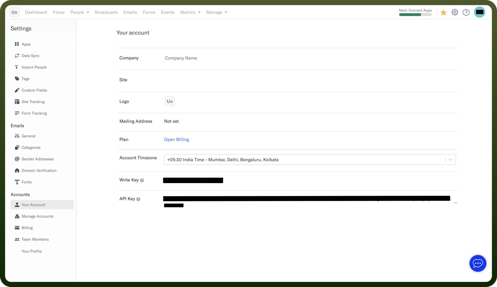

# Encharge connector

Source: https://www.unifyapps.com/docs/unify-integrations/encharge
Section: integrations

---

Encharge is a marketing automation platform that helps businesses create personalized customer journeys through behavior-based email automation. It integrates with various tools to streamline lead nurturing and customer engagement.

Integrating your application with Encharge enables you to automate marketing workflows, send personalized emails, and manage customer data efficiently.

## Authentication

Before you begin, make sure you have the following information:

- `Connection Name`**:** Choose a descriptive name for your connection, such as "MyAppEnchargeIntegration", to easily identify it within your application or integration settings.
- `Authentication Type`**:** Encharge supports two authentication methods:
  - API Key
  - OAuth2 .0 Based Authentication

### API Key

- Log in to your Encharge account and navigate to the profile icon at the top right corner.
- Navigate to Your Account section.
- Locate your API key and copy it for use in the integration.
- Keep your API key confidential, as it grants access to your Encharge account.

### OAuth2 .0 Based Authentication

- To use OAuth2 .0 Based Authentication , you need a "`Client ID`" and "`Client Secret`".
- Fill out [this form](https://research.typeform.com/to/I680YtLA) to request your Client ID and Client Secret.
- During the request, you must provide the `Callback URL`, which is displayed in in the Callback URL section here.
- Once approved, use the credentials to authenticate your application securely.

  

## Actions

| Actions | Description |
|---|---|
| `Add or update person` | Creates a new person or updates an existing person in Encharge. |
| `Add tag` | Tags a person in Encharge. |
| `Archive person` | Archives a person in Encharge. |
| `Remove tag` | Removes a tag from a person in Encharge. |
| `Unsubscribe person` | Stops all emails to a person in Encharge. |

## Triggers

| Triggers | Description |
|---|---|
| `New person` | Triggers when a new person is created in Encharge. |
| `Person unsubscribed` | Triggers when a person is unsubscribed in Encharge. |
| `Tag added to person` | Triggers when a person is tagged in Encharge. |
| `Tag removed from person` | Triggers when a person is untagged in Encharge. |
| `Updated person` | Triggers when a person is updated in Encharge. |
