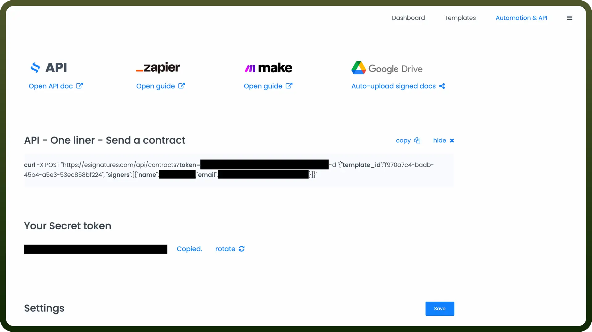

# ESignatures connector

Source: https://www.unifyapps.com/docs/unify-integrations/esignatures
Section: integrations

---

E-signatures enable the secure and legally binding digital signing of documents, eliminating the need for physical paperwork. They streamline workflows, improve efficiency, and ensure compliance across various industries.

Integrating your application with eSignatures allows you to streamline document signing processes.

## Authentication

Before you begin, make sure you have the following information:

- `Connection Name`**:** Select a descriptive name for your connection, like "MyAppeSignaturesIntegration." This helps in easily identifying the connection within your application or integration settings.
- `Authentication Type`**:** eSignatures supports Secret Token for authentication. This method ensures secure access to eSignatures functionalities and data.

### Secret Token Based Authentication

- Log in to your eSignatures account and navigate to your Automation & API section.
- You will find the token under “`Your Secret token`”.
- Treat this token with high confidentiality, as it grants access to your eSignatures account.

  

## Actions

| **Actions** | **Description** |
|---|---|
| `On contract sent to a signer` | Triggers when a contract is sent to a signer |
| `On contract signed` | Triggers when a contract is signed by all signers |
| `On delivery failed` | Triggers when a new error is thrown, e.g., when an email can't be delivered |
| `On mobile number update request by signer` | Triggers when a signer requests a mobile number update |
| `On signer signed the contract` | Triggers when a contract is signed by a signer |

## Triggers

| Triggers | Description |
|---|---|
| `Add signer` | Adds a new signer in the contract using eSignatures |
| `Create contract` | Creates a new contract using eSignatures |
| `Delete signer` | Deletes a signer in the contract using eSignatures |
| `Get contract` | Gets contract details using eSignatures |
| `Update signer` | Updates a signer in the contract using eSignatures |
