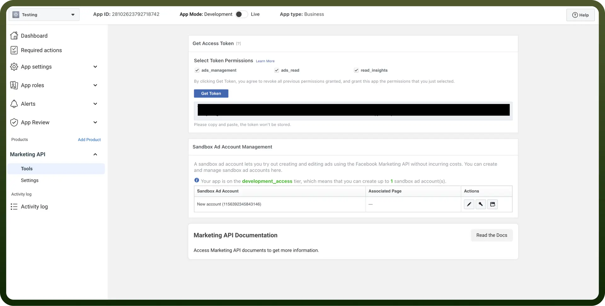
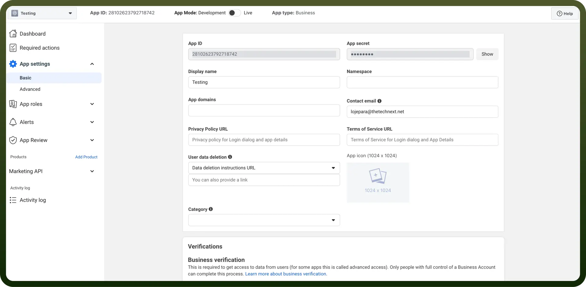

# Facebook Ads integration

Source: https://www.unifyapps.com/docs/unify-integrations/facebook-ads
Section: integrations

---

Facebook Ads is a powerful advertising platform that enables businesses to reach targeted audiences based on demographics, interests, and behaviors. It offers a variety of ad formats to promote products, services, and brand awareness across Facebook, Instagram, and partner networks.

Integrating your application with Facebook Ads streamlines campaign management, offering comprehensive tools for ad creation, performance tracking, and audience targeting, all while providing valuable insights to optimize your advertising strategy.

## Authentication

Ensure you have the following information ready for a seamless integration process:

- `Connection Name`**:** Select a descriptive name for your connection, like 'MyAppFacebookAdsIntegration'. This helps easily identify the connection within your application or integration settings.
- `Authentication Type`**:** Facebook Ads supports token-based and OAuth authentication for server-to-server integrations. This allows admins to take actions within Facebook without user interference.

### OAuth

- Press the `Authorize` button. You'll be redirected to a Facebook sign-in page.
- If you're not already logged into Facebook, enter your Facebook account credentials.
- Facebook will display a permissions request screen. You'll see our app name and the specific services we request access to.
- Carefully review the permissions we're asking for. If you're comfortable with the permissions, click the "`Allow`" or "`Grant Access`" button.
- After granting access, you'll be automatically redirected back to our platform. You should see a confirmation message that your Facebook account is now connected.

### OAuth with Client Credentials

- Obtain your Facebook App's Client ID and Client Secret from the [Facebook Developers Console](https://developers.facebook.com/).
- Enter these credentials in the designated fields in our platform:
  - `Client ID`: Your Facebook application's unique identifier.
  - `Client Secret`: Your application's secure authentication key.
- After entering valid credentials, the platform will establish a secure connection with your Facebook Ads account.
- You'll see a confirmation message once the connection is successfully established.

  

### Token Based Authentication

- Log into your [Facebook Developers Console](https://developers.facebook.com/).
- Navigate to your App's settings.
- Go to the '`Tools & Support`' section and select '`Graph API Explorer`'.
- Click '`Generate Access Token`'.
- Select the required permissions for Facebook Ads:
  - `ads_management`
  - `ads_read`
  - `business_management`
- Copy the generated token.
- Paste the token into our platform's authentication field.
- The platform will validate the token and establish the connection.
- You'll receive a confirmation once the connection is successful.

  

## Actions

| Actions | Description |
|---|---|
| `Create ad adset` | Creates an ad adset in Facebook Ads |
| `Create ad campaign` | Creates an ad campaign in Facebook Ads |
| `Delete adsets` | Deletes an adset in Facebook Ads |
| `Delete ad campaign` | Deletes an ad campaign in Facebook Ads |
| `Get Ads ID` | Gets ads ID in Facebook Ads |
| `Get Adset insights` | Gets Adset insights by ID in Facebook Ads |
| `Get Adset insights report` | Gets Adset insights report in Facebook Ads |
| `Get Adsets ID` | Gets Adsets ID in Facebook Ads |
| `Get Campaign Insights` | Gets campaign insights by campaign ID in Facebook Ads |
| `Get campaign ID` | Gets campaign ID in Facebook Ads |
| `Get campaign insights report` | Gets campaign insight report in Facebook Ads |
| `List Adsets` | Lists all ad sets related to a particular ad account in Facebook Ads |
| `List Campaigns` | Lists all campaigns related to a particular ad account in Facebook Ads |
| `Update  ad campaig` | Updates an ad campaign in Facebook Ads |
