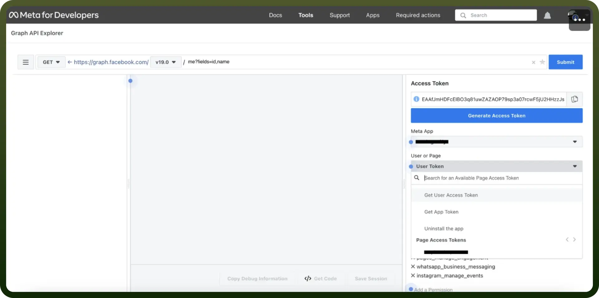

# Facebook Groups integration | connect with UnifyApps

Source: https://www.unifyapps.com/docs/unify-integrations/facebook-groups
Section: integrations

---

A **Facebook Group** is an online community on Facebook where people with shared interests can connect, discuss, and share content. Groups can be public or private and are used for networking, support, discussions, and collaboration.

Integrating your application with Facebook enhances social media engagement, offering features like posting updates, managing groups, and accessing user data for personalized experiences.

## Authentication

Before you begin, make sure you have the following information:

- `Connection Name`**:** Select a descriptive name for your connection, such as "MyAppFacebookIntegration". This name helps in easily identifying the connection within your application or integration settings.
- `Authentication Type`:Facebook supports Token for authentication, which is particularly useful for managing Facebook Groups.

### Token Based Authentication

- Go to the [Facebook Developers](https://developers.facebook.com/) website and log in with your Facebook account.
- Click on "`My Apps`" in the top right corner and select "`Create App`".
- Provide the necessary information to create the app and click on “`Create App`” button.
- Navigate to the "`Tools`" section in your app's dashboard and select “`Graph API Explorer`”.
- In the Access Token section, select the `Meta app` that you have created.
- In the User or Page field, select the `user token`.
- Now, Provide the required permissions for the actions you want to execute.
- Finally, Click on `Generate Access token`. Treat this token with high confidentiality, as it allows access to your Facebook account.

## **Actions**

| Actions | Description |
|---|---|
| `Get group by ID` | Gets group details by ID from Facebook |
| `Get group event` | Get group event by ID from Facebook |
| `Get group feed by ID` | Gets group feed by ID from Facebook |
| `Publish group feed` | Publishes group feed in Facebook |
| `Get group by ID` | Gets group details by ID from Facebook |
| `Get group event` | Get group event by ID from Facebook |
| `Get group feed by ID` | Gets group feed by ID from Facebook |
| `Publish group feed` | Publishes group feed in Facebook |
