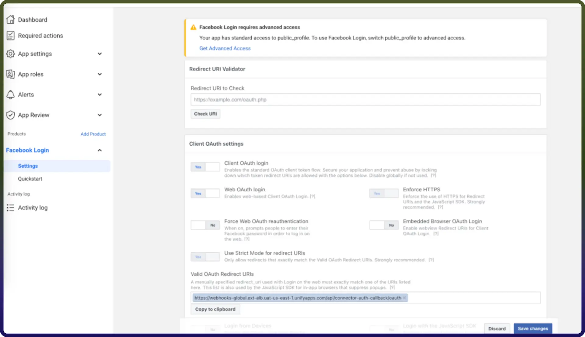

# Facebook pages integration | connect with UnifyApps

Source: https://www.unifyapps.com/docs/unify-integrations/facebook-pages
Section: integrations

---

Integrating your application with Facebook Pages enhances social media management by enabling you to manage page content, engage with audiences, and monitor interactions directly within your workflows, allowing you to publish content, track engagement, and manage interactions across your social presence efficiently. Facebook Pages provides APIs to handle posts, comments, messages, and insights efficiently, helping businesses streamline communication and improve audience engagement.

## Authentication:

Before you begin, ensure you have the following information: 
`Connection Name :` Choose a meaningful name for your connection. This name helps you identify the connection within your application or integration settings. It could be something descriptive like "MyAppFacebookPagesIntegration".
`Authentication Type`: Facebook Pages supports API Token Based Authentication.

### API Token Based:

1. Go to the [Facebook Developers](https://developers.facebook.com/) website and log in with your Facebook account.
2. Click on "My Apps" in the top right corner and select "Create App".
3. Provide the necessary information to create the app and click on the “Create App” button.
4. Now, Navigate to the "Tools" section in your app's dashboard and select “Graph API Explorer”.
5. In the Access Token section, select the Meta app that you have created.
6. In the User or Page field, select user token.
7. Now, Provide the required permissions for the actions you want to execute.
8. Finally, Click on the Generate Access token. Treat this token with high confidentiality, as it allows access to your Facebook account.

## Actions

| **Action Name** | **Description** |
|---|---|
| `Create page form` | Creates a new page form on a page on Facebook |
| `Create post` | Creates a new post on a page on Facebook |
| `Get page insights` | Gets insights for a page on Facebook |
| `Get post insights` | Gets insights for a specific post on Facebook |
| `Send message` | Sends a message to a user from a Facebook Page |
| `Send message with audio` | Sends a message with audio to a user from a Facebook Page |
| `Send message with file` | Sends a message with file to a user from a Facebook Page |
| `Send message with image` | Sends a message with image to a user from a Facebook Page |
| `Send message with template` | Sends a message with template to a user from a Facebook Page |
| `Send message with video` | Sends a message with video to a user from a Facebook Page |
| `Update post` | Updates a post on Facebook |
