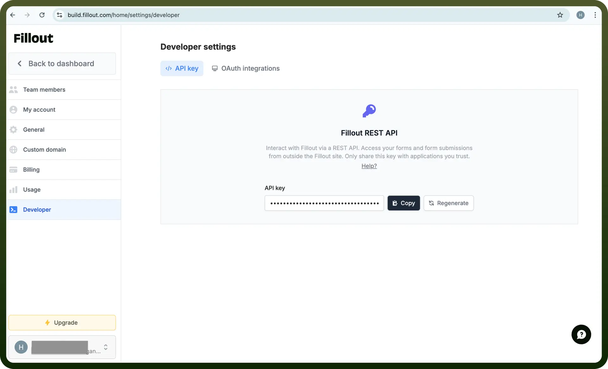
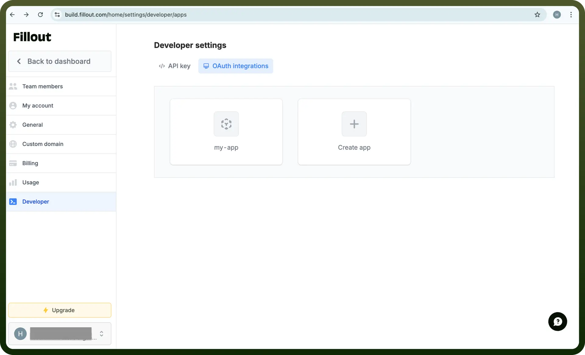

# Fillout connector

Source: https://www.unifyapps.com/docs/unify-integrations/fillout
Section: integrations

---

Fillout is a powerful form builder that allows you to create customizable, logic-driven forms with seamless integrations. It’s designed for collecting and managing data efficiently without requiring coding skills.

Integrating your application with Fillout's REST API simplifies form management and submission automation, enabling efficient and seamless workflows.

## Authentication

Before you begin, make sure you have the following information:

- `Connection Name`**:** Choose a unique and meaningful name for your connection. This name helps identify the connection within the UnifyApps platform, such as 'MyFilloutIntegration'.
- `Authentication Type`**:** Select the authentication method to connect to Fillout:
  - Auth Token
  - OAuth

### Auth Token-Based Authentication

1. Log in to your Fillout account and navigate to the `Developer` section in your account settings.
2. Generate an API key or authentication token.
3. Copy the generated token immediately, as it may not be visible again after you leave the page.
4. Treat this token as confidential and secure, as it provides access to your fillout account.

  

### OAuth-Based Authentication

1. Log in to your Fillout account.
2. Go to the `Settings` menu, then navigate to the `Developer` section.
3. Click on the `OAuth Integrations` section. Locate the application for which you want to integrate, where you will find the Client ID and Client Secret. If you do not have an application created earlier, you will need to create one first.
4. Ensure that the application is configured with the required redirect URLs and permissions.
5. Use the `Client ID` and `Client Secret` to complete the authentication flow during setup

  

## Actions

| Actions | Description |
|---|---|
| `Get forms` | Retrieves a list of all forms from Fillout. |
| `Get metadata and questions` | Retrieves all questions and related metadata for the given form ID from Fillout. |
| `Get specific submission details` | Retrieves detailed information about a submission for the given form ID and submission ID using Fillout. |
| `Get submissions` | Retrieves all submissions for the specified form ID from Fillout. |

## Triggers

| Triggers | Description |
|---|---|
| `New submission` | Triggers when a form with the given form ID receives a new submission in Fillout |
