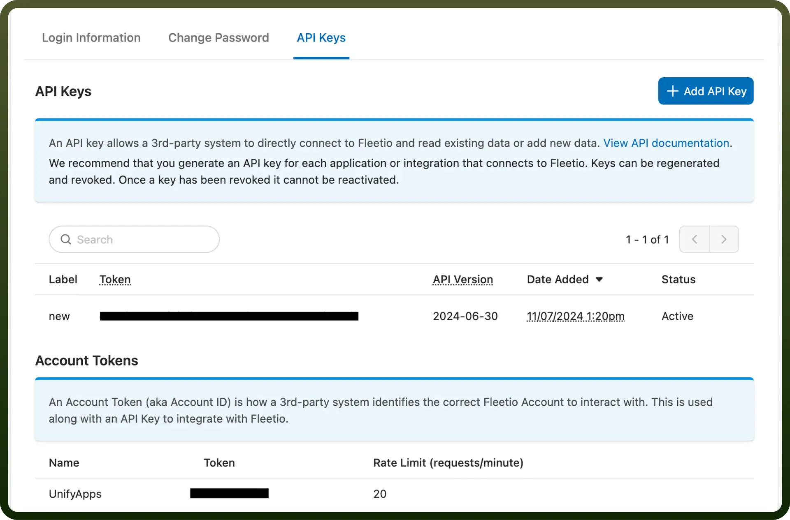

# Fleetio connector

Source: https://www.unifyapps.com/docs/unify-integrations/fleetio
Section: integrations

---

Fleetio is a cloud-based fleet management system that streamlines vehicle maintenance, fuel tracking, inspections, and driver management. It helps businesses increase efficiency, reduce costs, and optimize fleet performance through real-time insights.

Connecting your application to a Fleetio account enables integration for Fleet management functionalities, including vehicle tracking, maintenance scheduling, and data analysis.

## Authentication

Before you begin, make sure you have the following information:

- `Connection Name`: Select a descriptive name for your connection, like "MyAppFleetioIntegration". This helps in easily identifying the connection within your application or integration settings.
- `Authentication Type`: Fleetio supports Access Token Authentication.

### Access Token Based Authentication

For Access Token-based authentication, you'll need to perform the following steps to fetch API Key and Account Token:

- **API Key:**
  - Log in to your Fleetio account.
  - In the left Navigation menu, click on the profile icon on the top corner.
  - Click on the account settings and navigate to the "`Manage API Key`" under your profile section and you'll be redirected to API key page.
  - Click on "`Add API Key`" button in the API Keys section.
  - Provide the label , API version and click on save button. The API key will be successfully generated.
  - Copy the token mentioned against the label of the API label you created.
  - Treat the API key with high confidentiality, as it allows access to your Fleetio account.
- **Account Token:**
  - In the Account tokens section, copy the token mentioned against your Account name.
  - Navigate to generate or view your API Key and Account Token.
  - Treat the Account Token with high confidentiality, as it allows access to your Fleetio account.

## Actions

| **Action Name** | **Description** |
|---|---|
| `Archive vehicle` | Archives a vehicle from Fleetio |
| `Create service reminder` | Creates a service reminder in Fleetio |
| `Create service task` | Creates a service task in Fleetio |
| `Create vehicle` | Creates a vehicle in Fleetio |
| `Create vehicle status` | Creates a vehicle status in Fleetio |
| `Create work order` | Creates a work order in Fleetio |
| `Create work order line item` | Creates a work order line item in Fleetio |
| `Delete Vehicle Status` | Deletes a vehicle status from Fleetio |
| `Delete service task` | Deletes a service task from Fleetio |
| `Delete vehicle` | Deletes a vehicle from Fleetio |
| `Delete work order line item` | Deletes a work order line item from Fleetio |
| `Delete service reminder` | Deletes a service reminder in Fleetio |
| `Delete a work order` | Deletes a work order in Fleetio |
| `Get service reminder` | Gets a service reminder in Fleetio |
| `Get service task` | Gets a service task in Fleetio |
| `Get vehicle` | Gets a vehicle from Fleetio |
| `Get vehicle purchase details` | Gets a vehicle's purchase details from Fleetio |
| `Get vehicle status` | Gets a vehicle status from Fleetio |
| `Get vehicle's current assignment` | Gets a vehicle’s current assignment by its ID from Fleetio |
| `Get work order` | Gets a work order in Fleetio |
| `Get work order line item` | Retrieves a work order line item from Fleetio |
| `List vehicle statuses` | Lists vehicle statuses from Fleetio |
| `List accounts` | Lists accounts from Fleetio |
| `List archived vehicles` | Lists archived vehicles from Fleetio |
| `List linked vehicles` | Lists linked vehicles from Fleetio |
| `List service tasks` | Lists service tasks from Fleetio |
| `List vehicle assignments` | Lists vehicle assignments from Fleetio |
| `List vehicle fuel entries` | Lists vehicle fuel entries from Fleetio using vehicle ID |
| `List vehicles` | Lists vehicles from Fleetio |
| `List vehicles meter entries` | Lists vehicles meter entries from Fleetio |
| `List work order line items` | Lists work order line items from Fleetio |
| `List work orders` | Lists work orders from Fleetio |
| `Restore a vehicle` | Restores a vehicle in Fleetio |
| `Update Vehicle Status` | Updates a vehicle status in Fleetio |
| `Update service reminder` | Updates a service reminder in Fleetio |
| `Update service task` | Updates a service task in Fleetio |
| `Update vehicle` | Updates a vehicle in Fleetio |
| `Update work order` | Updates a work order in Fleetio |
| `Update work order line item` | Updates a work order line item in Fleetio |

## Triggers

| **Trigger** | **Description** |
|---|---|
| `New vehicle` | Triggers when a new vehicle is created in Fleetio |
| `New vehicle assignment` | Triggers when a new vehicle assignment is created in Fleetio |
| `New work order` | Triggers when a new work order is created in Fleetio |
| `Vehicle assigned` | Triggers when a vehicle is assigned in Fleetio |
| `Vehicle assignment deleted` | Triggers when a vehicle assignment is deleted in Fleetio |
| `Vehicle assignment updated` | Triggers when a new vehicle assignment is updated in Fleetio |
| `Vehicle deleted` | Triggers when a vehicle is deleted in Fleetio |
| `Vehicle status updated` | Triggers when a vehicle status is updated in Fleetio |
| `Vehicle updated` | Triggers when a vehicle is updated in Fleetio |
| `Work order deleted` | Triggers when a work order is deleted in Fleetio |
| `Work order status updated` | Triggers when a work order status is updated in Fleetio |
| `Work order updated` | Triggers when a work order is updated in Fleetio |
