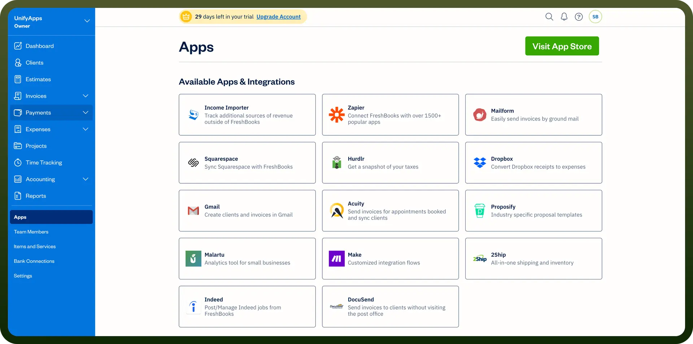
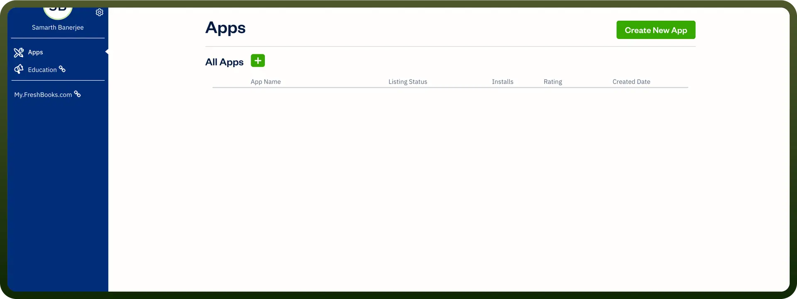
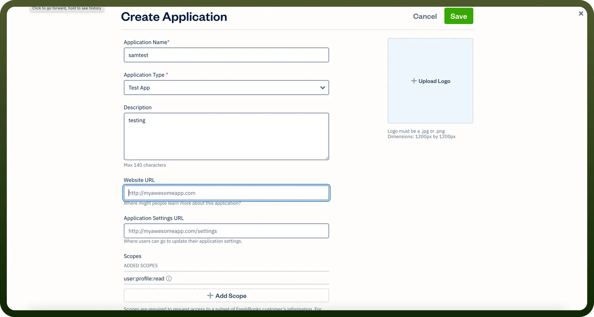
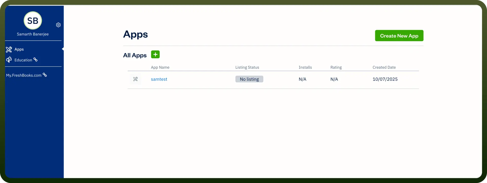
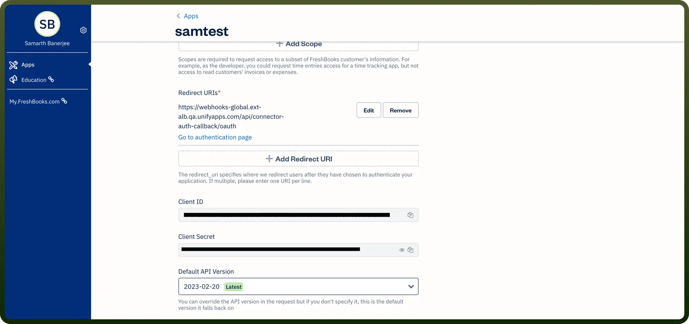

# FreshBooks connector

Source: https://www.unifyapps.com/docs/unify-integrations/freshbooks
Section: integrations

---

FreshBooks is a cloud-based accounting software designed for small businesses and freelancers to easily manage invoices, track expenses, and accept online payments. It offers time tracking, automated billing, and detailed financial reporting to simplify bookkeeping.

FreshBooks stands out for its exceptionally intuitive interface and automation features, making invoicing and expense tracking faster and easier than many competitors.

### Authentication

Before you begin, make sure you have the following information:

- `Connection Name`: Choose a meaningful name for your connection. This name helps you identify the connection within your application or integration settings. It could be something descriptive like ‘FreshbookConnection’.
- `Authentication Type`: Freshbooks API uses OAuth with Client Credentials for authentication.

### OAuth with Client Credentials

- Log in to your FreshBooks account and navigate to the ‘`developers dashboard`’.
- Navigate to ‘`apps`’ and click on ‘`create apps`’ option
- Create or register an application by filling up the form and submitting
- From your created or registered application locate and copy ‘`Client ID`’ and ‘`Client secret`’. Store them securely for further use.

## Actions

| **Actions** | **Description** |
|---|---|
| `Create client` | Creates a client in FreshBooks |
| `Create expense` | Creates an expense in FreshBooks |
| `Create invoice` | Creates an invoice in FreshBooks |
| `Create item` | Creates an item in FreshBooks |
| `Create payment` | Creates a new payment in FreshBooks |
| `Get client details by ID` | Gets client details in FreshBooks |
| `Get item details` | Gets item details in FreshBooks |
| `Get staff details` | Gets staff details in FreshBooks |
| `Search client` | Searches client details in FreshBooks |
| `Update client` | Updates a client in FreshBooks |
| `Update invoice` | Updates an invoice in FreshBooks |

## Triggers

| **Triggers** | **Description** |
|---|---|
| `New client` | Triggers when a new client is created in FreshBooks |
| `New estimate` | Triggers when a new estimate is created in FreshBooks |
| `New invoice` | Triggers when a new invoice is created in FreshBooks |
| `New payment` | Triggers when a new payment is created in FreshBooks |
| `Updated client` | Triggers when a client is updated in FreshBooks |
| `Updated estimate` | Triggers when an estimate is updated in FreshBooks |
| `Updated invoice` | Triggers when an invoice is created in FreshBooks |
| `Updated payment` | Triggers when a payment is updated in FreshBooks |
