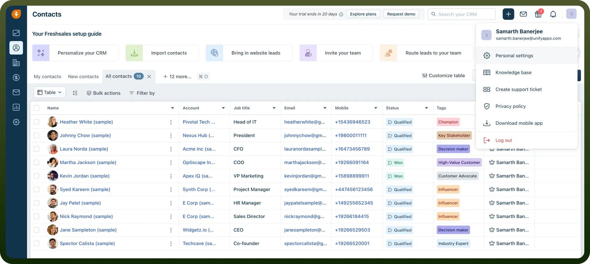
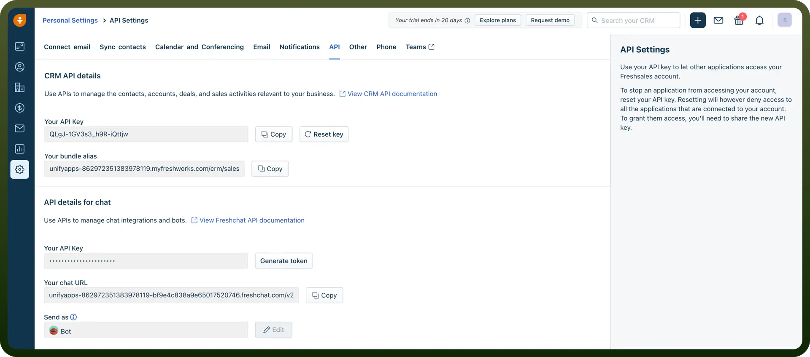

# Freshsales connector

Source: https://www.unifyapps.com/docs/unify-integrations/freshsales
Section: integrations

---

Freshsales is a Customer Relationship Management (CRM) software that helps sales teams manage leads, track emails, and visualize their sales pipeline. It includes AI-powered insights, automation tools, and an integrated calling system. The platform enables businesses to streamline their sales processes and close more deals efficiently.

Freshsales offers a built-in phone and email system with AI-driven lead scoring, giving sales teams a faster and smarter way to prioritize and connect with prospects—all in one platform.

## Authentication

Before you begin, make sure you have the following information:

- `Connection Name`: Choose a meaningful name for your connection. This name helps you identify the connection within your application or integration settings. It could be something descriptive like ‘Freshsales Connection’.
- `Authentication Type`: Freshbooks API uses API Token for authentication.

### API Token

- Log in to your Freshsales account and click on the ‘`profile icon`’ at the top right corner.
- Navigate to ‘`Personal Settings`’ from the dropdown menu
- In the ‘`Personal Settings`’ page, navigate to the ‘`API`’ tab
- API Token will be created, copy and store securely for further use.

  

  

## Actions

| **Actions** | **Description** |
|---|---|
| `Create sales account` | Creates a sales account in Freshsales |
| `Create task` | Creates a task in Freshsales |
| `Delete contact` | Delete contact in Freshsales |
| `Delete custom module record` | Deletes a custom module record in Freshsales |
| `Delete deal` | Delete deal in Freshsales |
| `Delete note` | Deletes a note in Freshsales |
| `Delete sales account` | Delete sales account in Freshsales |
| `Delete sales activity` | Deletes a sales activity in Freshsales |
| `Delete task` | Deletes a task in Freshsales |
| `Get contact details` | Gets contact details from Freshsales |
| `Get custom module record details` | Gets custom module record details from Freshsales |
| `Get deal details` | Gets deal details from Freshsales |
| `Get sales account details` | Gets sales account details from Freshsales |
| `Get sales activity details` | Gets sales activity details from Freshsales |
| `Get task details` | Gets task details from Freshsales |
| `Lookup search` | Retrieve list of records details in Freshsales |
| `Remove contacts from a marketing list` | Remove contacts from a marketing list in Freshsales |
| `Search contacts` | Search contacts in Freshsales |
| `Search deals` | Search deals in Freshsales |
| `Search records by query` | Retrieve list of records by query in Freshsales |
| `Search sales accounts` | Search sales accounts in Freshsales |
| `Search tasks` | Search tasks in Freshsales |
| `Update contact` | Update contact in Freshsales |
| `Update custom module record` | Updates a custom module record in Freshsales |
| `Update marketing list` | Updates a marketing list in Freshsales |
| `Update note` | Updates a note in Freshsales |
| `Update task` | Updates a task in Freshsales |
| `Upsert contact` | Upsert contact in Freshsales |
| `Upsert deal` | Upsert deal in Freshsales |
| `Upsert sales account` | Upsert sales account in Freshsales |
| `Move contacts to a marketing list` | Mode contacts to a marketing list in Freshsales |
| `Add contacts to a marketing list` | Add contacts to a marketing list in Freshsales |
| `Clone contact` | Clone contact in Freshsales |
| `Create contact` | Create contact in Freshsales |
| `Create custom module record` | Creates a custom module record in Freshsales |
| `Create marketing list` | Creates a marketing list in Freshsales |
| `Create note` | Creates a note in Freshsales |
