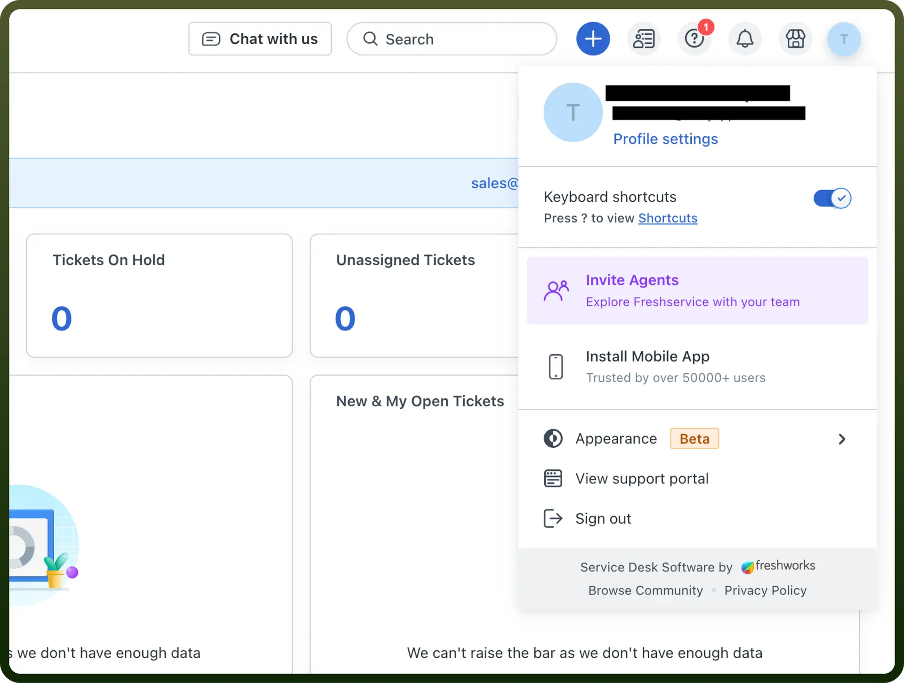

# Freshservice integration

Source: https://www.unifyapps.com/docs/unify-integrations/freshservice
Section: integrations

---

Freshservice is a cloud-based IT service management (ITSM) solution designed to streamline IT operations, including incident management, asset tracking, and workflow automation. It offers an intuitive interface, customizable workflows, and integrations to improve efficiency and service delivery.

Integrating Freshservice enhances IT efficiency by centralizing operations, automating workflows, and improving service delivery.

## Authentication

Before you begin, make sure you have the following information:

- `Connection Name`: Select a descriptive name for your connection, like "MyAppFreshServiceIntegration". This helps in easily identifying the connection within your application or integration settings.
- `Authentication Type`: Freshservice provides api key authentication.This method ensures secure access to Freshservices’s functionalities and data.
- `Domain`**:** Enter your freshservice site domain. For example, e.g. [https://example.freshservice.com](https://example.freshservice.com).
- `API key`**:** Enter your freshservice API key.

## How to obtain the API key?

To generate an API token in Freshservice, follow these steps:

- Log in to the Freshservice Admin Console.
- Navigate to the Profile Settings In the top right corner, click on your profile icon and from the dropdown menu, select Profile Settings.
- Go to the `API Section`
- You will see an option to generate an API key. Click on `Generate API Key`.
- After generating the token, make sure to copy it immediately. Please keep this secure as it allows access to your Freshservice account.

  

## Actions

| Actions | Description |
|---|---|
| `Create incident` | Creates a new incident in Freshservice |
| `Create onboarding request` | Creates a new onboarding request in Freshservice |
| `Create requester` | Creates a new requester in Freshservice |
| `Create service request` | Creates a service request in Freshservice |
| `Get agent` | Gets agent details from Freshservice |
| `Get requester` | Gets requester details from Freshservice |
| `List Service Items` | Lists service items in Freshservice |
| `List agent fields` | Lists agent fields in Freshservice |
| `List onboarding form fields` | Lists onboarding form fields in Freshservice |
| `List requester fields` | Lists requester fields in Freshservice |
| `List ticket fields` | Lists ticket fields in Freshservice |
| `Search agent` | Searches for agents in Freshservice |
| `Search requester` | Searches for requesters in Freshservice |
| `Search ticket` | Searches for tickets in Freshservice |
| `Update requester` | Updates a requester in Freshservice |

## Triggers

| Triggers | Description |
|---|---|
| `On new or updated ticket` | Triggers when a ticket is created or updated in Freshservice |
| `On new ticket` | Triggers when a ticket is created in Freshservice |
