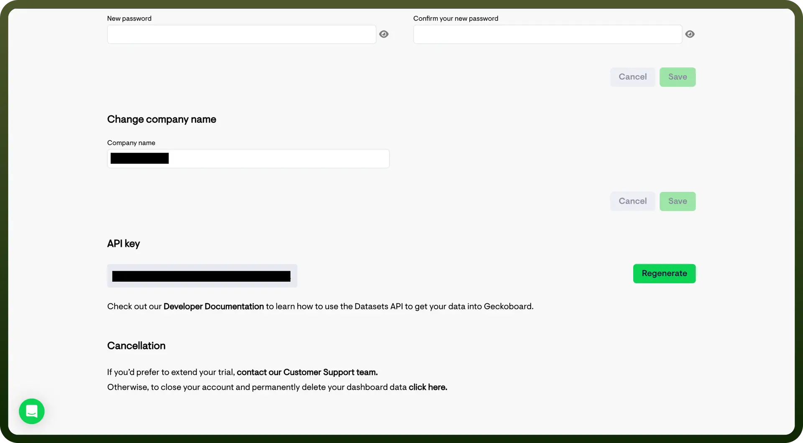

# Geckoboard connector

Source: https://www.unifyapps.com/docs/unify-integrations/geckoboard
Section: integrations

---

**Geckoboard** is a real-time dashboard tool that visualizes key metrics from business systems, enabling teams to monitor performance at a glance. It supports custom widgets and live data updates from various sources.

Integrating geckoboard provides instant visibility into business-critical KPIs, helping teams stay aligned, spot issues early, and make data-driven decisions.

## Authentication

Before you begin, make sure you have the following information:

- `Connection Name`: Select a descriptive name for your connection, like "MyAppGeckoboardIntegration". This helps in easily identifying the connection within your application or integration settings.
- `Authentication Type`**:** Geckoboard supports API Key authentication.

### API Key Based Authentication

- Log into your Geckoboard account and navigate to the "`Account`" section from the menu.
- In the "`API Keys`" tab, you will find your unique API Key.
- If an API Key is not yet generated, click on "Regenerate" to create one.
- Copy the API Key and keep it secure, as it grants access to your Geckoboard account.

  

## Actions Supported

| **Actions** | **Description** |
|---|---|
| `Add record to dataset` | Adds record to a dataset in Geckoboard |
| `Delete dataset` | Deletes a dataset in Geckoboard |
| `Update custom gauge widget` | Sends new values to a custom gauge widget in Geckoboard |
| `Update custom number widget` | Sends new values to a custom number widget in Geckoboard |
| `Update custom text widget` | Sends new values to a custom text widget in Geckoboard |
