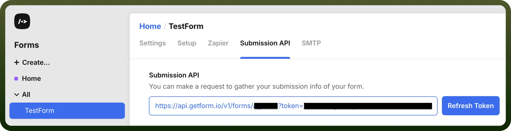

# Getform connector

Source: https://www.unifyapps.com/docs/unify-integrations/getform
Section: integrations

---

Getform is a backend platform that enables you to collect form submissions from static websites without writing server-side code. Easily integrate with HTML forms and manage submissions via a clean dashboard or API.

Integrating Getform lets you effortlessly collect, manage, and automate form submissions without maintaining backend infrastructure.

### Authentication

Before you begin, ensure you have the following information:

- `Connection Name`: Select a descriptive name for your connection, like "MyAppGetformIntegration". This helps in easily identifying the connection within your application or integration settings.
- `Authentication Type`**:** Getform supports API tokens for authentication.

### API Token Based Authentication

1. Navigate to the “`Submission API`” section
2. Copy the token included in the URL as ”`getform_api_token`”.
3. Copy the Form ID included in the URL as ”`form_id`”.
4. Store these securely as they provide access to your Getform account.

  

## Actions

| Actions | Description |
|---|---|
| `Get form submissions` | Gets form submissions from Getform |
