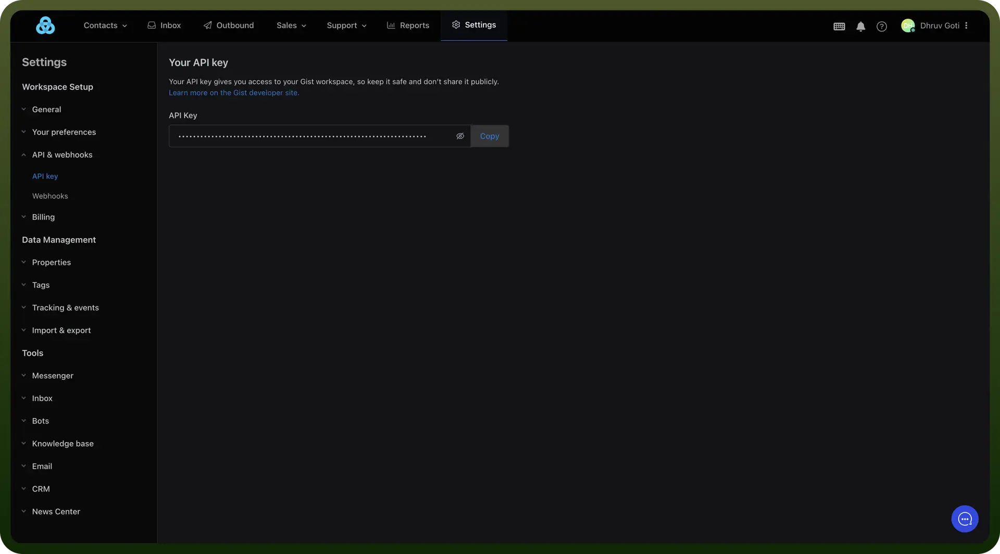
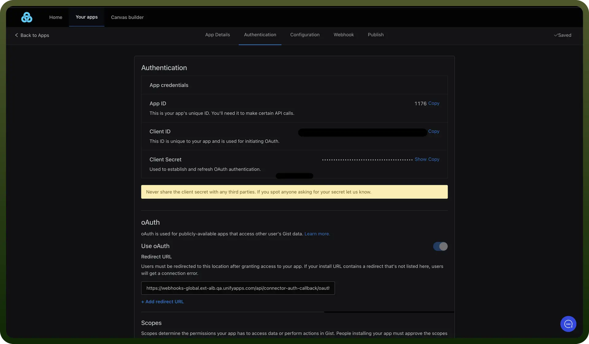

# GetGist connector

Source: https://www.unifyapps.com/docs/unify-integrations/getgist
Section: integrations

---

GetGist is an all-in-one marketing automation and CRM platform that helps businesses engage, nurture, and convert leads through email, chat, and campaigns. It centralizes customer communication and contact management for better lead tracking.

Integrating GetGist streamlines contact updates, campaign actions, and personalized communication, improving customer engagement and conversion rates.

## Authentication

Before you begin, make sure you have the following information:

- `Connection Name`: Select a descriptive name for your connection, like "MyAppGetGistIntegration". This helps in easily identifying the connection within your application or integration settings.
- `Authentication Type`**:** Select the type of authentication for connecting to your GetGist account:
  - API Key
  - OAuth

### API Key Based Authentication

- Login into GetGist Console and go to Settings.
- Click on "`API & webhooks`" at the left side.
- Click on "`API-Key`" and store it securely as it allows access to your GetGist account.

  

### OAuth Based Authentication

- Visit the developer console and select Create new app.
- Register your application to [GetGist developer portal](https://app.getgist.com/developer).
- Click on "`Authentication`".
- Copy your client ID and client secret and store it securely to prevent unauthorized access.
- Redirect URL section paste below link. **Note:** In the Redirect URL section paste the following link [https://webhooks-global.ext-alb.qa.unifyapps.com/api/connector-auth-callback/oauth](https://webhooks-global.ext-alb.qa.unifyapps.com/api/connector-auth-callback/oauth).

  

## **Actions**

| Actions | Description |
|---|---|
| `Add tag to contact` | Adds tag to an existing contact in GetGist |
| `Create or update contact` | Creates a new contact or updates an existing one in GetGist |
| `Find contact` | Finds a contact in GetGist |
| `Remove tag from contact` | Removes tag from an existing contact in GetGist |
| `Subscribe contact to campaign` | Subscribes contact to a campaign in GetGist |
| `Unsubscribe contact from campaign` | Unsubscribes contact from a specific campaign in GetGist |

## Triggers

| Triggers | Description |
|---|---|
| `On new contact` | Triggers when a new contact is added to your account in GetGist |
