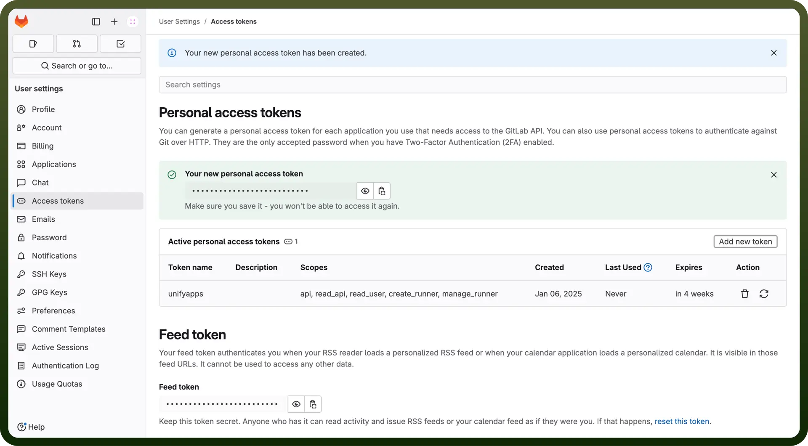

# Gitlab connector

Source: https://www.unifyapps.com/docs/unify-integrations/gitlab
Section: integrations

---

GitLab is a web-based DevOps platform that provides a complete CI/CD toolchain for software development, enabling version control, collaboration, and automation. It integrates features like Git repository management, issue tracking, and pipeline creation in a single interface.

Integrating GitLab streamlines development workflows, enhances collaboration, automates CI/CD, and improves code quality and deployment efficiency.

## Authentication

Before integrating Gitlab, ensure you have the following information:

- `Connection Name`: Choose a descriptive name for your Gitlab connection to help you identify it within your application or integration settings. A meaningful name, like "MyAppGitlabIntegration," helps maintain organization, especially when managing multiple integrations.
- `Authentication Type`: Select the type of authentication to connect to your Gitlab account securely:
  - Access Token
  - No Auth

### Access Token based authentication

Use a personal access token to securely connect to GitLab. Tokens provide granular access control and are tied to a user account. This method is ideal for automation and integrations. Follow the steps to get your access token in GitLab:

1. Log in to your GitLab account.
2. Click on your avatar in the top-right corner of the left menu and select "`Edit Profile`".
3. In the left menu, select Access Tokens under "`Personal`."
4. Enter a descriptive name for your token and (optionally) set an expiration date.
5. Select the required scopes (e.g., api, read_repository).
6. Click Create personal access token and copy the generated token. Store it securely, as it provides access to your Gitlab account.

  

### No Auth

Choose this option when no authentication is required

## Scopes

| **Scope** | **Description** |
|---|---|
| `api` | Grants complete read/write access to the API, including all groups and projects, the container registry, the dependency proxy, and the package registry. |
| `read_api` | Grants read access to the API, including all groups and projects, the container registry, and the package registry. |
| `read_user` | Grants read-only access to your profile through the /user API endpoint, which includes username, public email, and full name. Also grants access to read-only API endpoints under /users. |
| `create_runner` | Grants create access to the runners. |
| `manage_runner` | Grants access to manage the runners. |
| `k8s_proxy` | Grants permission to perform Kubernetes API calls using the agent for Kubernetes. |
| `read_repository` | Grants read-only access to repositories on private projects using Git-over-HTTP or the Repository Files API. |
| `write_repository` | Grants read-write access to repositories on private projects using Git-over-HTTP (not using the API). |
| `read_registry` | Grants read-only access to container registry images on private projects. |
| `write_registry` | Grants write access to container registry images on private projects. You need both read and write access to push images. |
| `ai_features` | Grants access to GitLab Duo related API endpoints. |

## Actions

| **Action** | **Description** |
|---|---|
| `Create a file in repository` | Creates a file in repository |
| `Create branch` | Creates a repository branch in GitLab |
| `Create file` | Creates a file in a repository in GitLab |
| `Create issue` | Creates an issue in GitLab |
| `Create merge request` | Creates a merge request in GitLab |
| `Create project` | Creates a project in GitLab |
| `Create trigger token` | Creates a trigger token for a project in GitLab |
| `Delete a file from repository` | Deletes a file from a repository in GitLab |
| `Delete branch` | Deletes a branch in GitLab |
| `Delete file` | Deletes a file from a repository in GitLab |
| `Delete issue` | Deletes an issue in GitLab |
| `Delete merge request` | Deletes a merge request in GitLab |
| `Delete pipeline` | Deletes a pipeline in GitLab |
| `Delete project` | Deletes a project in GitLab |
| `Get issue` | Gets an issue by ID from GitLab |
| `Get namespace` | Gets namespace by ID from GitLab |
| `Get project` | Gets project by ID from GitLab |
| `List events` | Lists events of a project from GitLab |
| `List namespaces` | Lists namespaces from GitLab |
| `List pipelines` | Lists project pipelines from GitLab |
| `List trigger tokens` | Lists trigger tokens for a project from GitLab |
| `Merge merge request` | Merges a merge request in GitLab |
| `Trigger pipeline` | Triggers a pipeline by using a token in GitLab |
| `Update a file in repository` | Updates a file in repository in GitLab (repeated entry) |
| `Update file` | Updates a file in repository in GitLab |
| `Update issue` | Updates an issue in GitLab |
| `Update merge request` | Updates a merge request in GitLab |
| `Update project` | Updates a project in GitLab |

## Triggers

| Trigger | **Description** |
|---|---|
| `New or updated pipeline` | Triggers when an pipeline is created or updated in Gitlab |
| `On new event` | Triggers immediately when a new event occurs in GitLab |
