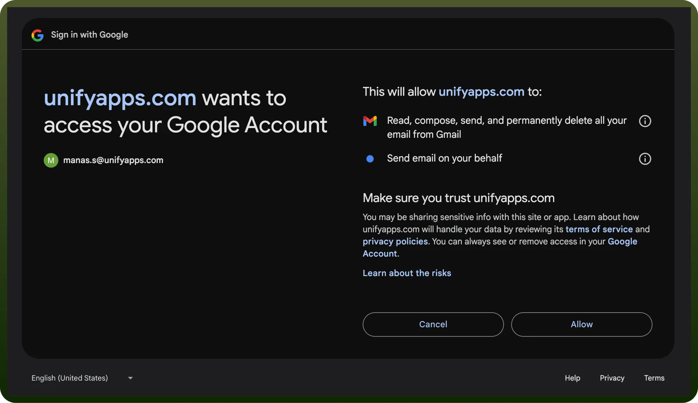
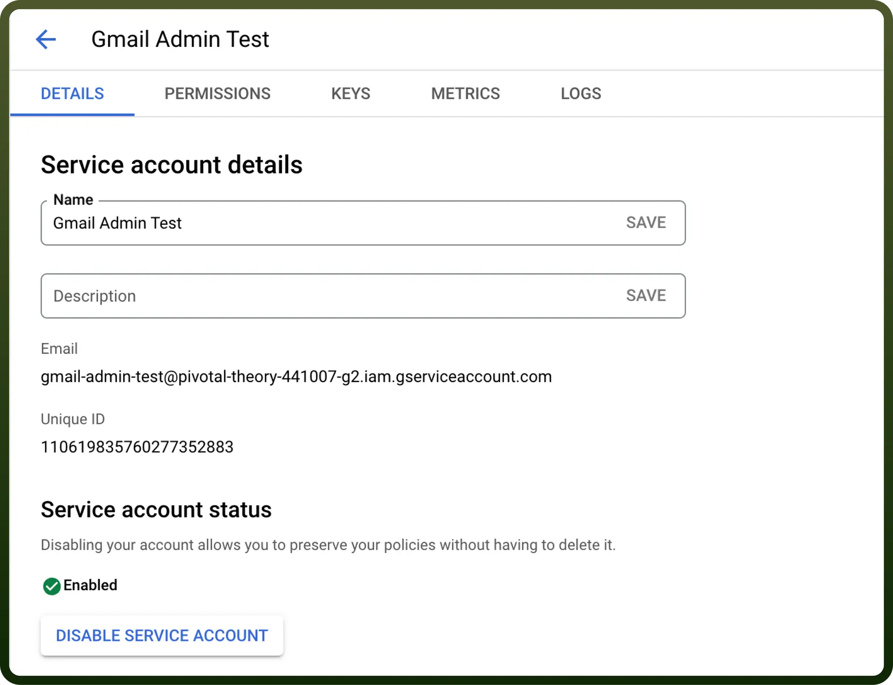

# Gmail connector

Source: https://www.unifyapps.com/docs/unify-integrations/gmail
Section: integrations

---

Gmail is a widely used email service by Google, allowing you to send, receive, and organize emails effortlessly. It offers robust features like spam filtering, advanced search, and integration with Google Drive and Calendar. With strong security and mobile access, Gmail is ideal for efficient, secure communication.

Integrating Gmail with your application enables seamless communication, email automation, and efficient data management.

## Authentication

Before integrating Gmail, ensure you have the following information:

- `Connection Name`: Choose a descriptive name for your Gmail connection to help you identify it within your application or integration settings. A meaningful name, like "MyAppGmailIntegration," helps maintain organization, especially when managing multiple integrations.
- `Authentication Type`: Select the type of authentication to connect to your Gmail account securely:
  - OAuth
  - Service Account Authentication

### OAuth Based Authentication

The OAuth  method involves signing in with your Google account credentials on Google's Single Sign-On page, and granting the necessary permissions to UnifyWorkflows, For **OAuth**-based authentication, you'll need to perform the following steps to generate access credentials:

1. Click on the Authorise button. You’ll be redirected to a Google sign-in page.
2. If you're not already logged into Google, enter your Google account credentials and Sign in.
3. Google will display a permissions request screen, showing the app name and the specific Google services we are requesting access to “`Read, compose, send, and permanently delete all your email from Gmail`” and “`Send email on your behalf`”.
4. Carefully review the permissions being requested. If you’re comfortable with them, click the "`Allow`" button.
5. After granting access, you will be automatically redirected back to our platform, where you should see a confirmation message indicating that your Google account is now connected.

  

### Service Account Based Authentication

- Create a service account by following these [steps](https://apps.google.com/supportwidget/articlehome?hl=en&article_url=https%3A%2F%2Fsupport.google.com%2Fa%2Fanswer%2F7378726%3Fhl%3Den&assistant_id=generic-unu&product_context=7378726&product_name=UnuFlow&trigger_context=a).
- Add domain-level access to the service account (based on client ID) by following these [steps](https://developers.google.com/cloud-search/docs/guides/delegation#delegate_domain-wide_authority_to_your_service_account).
- Ensure that the following scopes are added to your service account and domain-level access:
  - [https://www.googleapis.com/auth/gmail.send](https://www.googleapis.com/auth/gmail.send)
  - [https://www.googleapis.com/auth/gmail.modify](https://www.googleapis.com/auth/gmail.modify)
  - [https://www.googleapis.com/auth/gmail.compose](https://www.googleapis.com/auth/gmail.compose)
- Use the service account email, private key, and a sample user email to authenticate the connection.

  

## Actions Supported

| **Action** | **Description** |
|---|---|
| `Send Email` | Sends an email using Gmail. |
| `Add Labels` | Add labels to a message. |
| `Create Draft` | Creates a draft email in Gmail. |
| `Create draft reply` | Creates a draft reply to an email in Gmail. |
| `Creates a label` | Creates a label in Gmail. |
| `Delete email` | Moves the specified email to the trash. |
| `Download attachment` | Retrieves attachments from a specific email in Gmail |
| `Get a message` | Gets a message from Gmail. |
| `Get a specific thread` | Gets a specific thread from Gmail. |
| `Get message specifics` | Get specific details of a message. |
| `List Emails` | Lists all emails received on your Gmail account |
| `Remove label` | Removes labels from a message |
| `Reply in a thread` | Replies in a thread in Gmail |
| `Find Email` | Searches for email in gmail |

## Triggers Supported

| **Trigger** | **Description** |
|---|---|
| `New Email` | Triggers when a new email is received in Gmail. |
