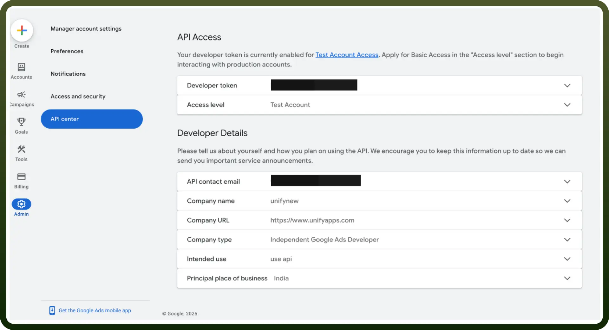

# Google Ads connector

Source: https://www.unifyapps.com/docs/unify-integrations/google-ads
Section: integrations

---

Google Ads is an online advertising platform that helps businesses reach their target audience through paid search, display, and video ads. It enables precise targeting, budget control, and performance tracking to drive traffic and conversions.

Integrating Google Ads maximizes ROI by streamlining ad management, improving targeting, and providing actionable insights for better campaign performance.

## Authentication

Ensure you have the following information ready for a seamless integration process:

- `Connection Name`**:** Select a descriptive name for your connection, like 'MyAppGoogleAdsIntegration'. This helps easily identify the connection within your application or integration settings.
- `Authentication Type`**:** Google Ads supports OAuth 2.0 for secure user authentication and authorization.

### OAuth 2.0-based Authentication

Perform the following steps to generate access credentials:

- Turn on the API services for Google Docs API and Google Drive API from `APIs & Services` -> `Enable APIs and services`**.**
- Create OAuth Client Credentials by following these [steps](https://support.google.com/cloud/answer/6158849?hl=en#).
- Set up an OAuth consent screen to configure OAuth consent for your application by the following [steps](https://support.google.com/cloud/answer/10311615?hl=en&ref_topic=3473162&sjid=10952494557109160158-AP) **.**
- After adding a new secret, the console displays the **Client Identifier** as “`Client ID`**”** and `Client Secret` as **“**`Client Secret`**”**. Copy this and treat it with high confidentiality, as it allows access to your Google Ads account.

  

- Use the `Client ID` and `Client secret`, press the Authorise button. You’ll be redirected to a Google sign-in page.
- If you're not already logged into Google, enter your Google account credentials and Sign in.
- Google will display a permissions request screen, showing the app name and the specific Google services we are requesting access to (e.g., Google Docs and Google Drive).
- Carefully review the permissions being requested. If you’re comfortable with them, click the "`Allow`" or "`Grant Access`" button.
- After granting access, you will be automatically redirected back to our platform, where you should see a confirmation message indicating that your Google account is now connected and authorized.
- Ensure that the following permissions are granted for **OAuth authentication** and provide public access to your documents in Google Drive.
  - [https://www.googleapis.com/auth/adwords](https://www.googleapis.com/auth/adwords)

**Developer Token:**

- Sign in to your Google Ads Manager account.
- Go to `Admin` > `API Center`.

  

- For detailed instructions, visit [Google Ads Manager Accounts](https://ads.google.com/home/tools/manager-accounts/).
- `Manager Customer ID`: This is the Customer ID of the target Google Ads manager account, a 10-digit string (e.g., XXXXXXXXXX). To find it:
  - Go to the account overview of your Manager account.
  - Choose the manager account linked to your team for managing the underlying ad accounts.
- Learn more about Manager accounts [here](https://ads.google.com/aw/accountaccess/managers).
- `Client Customer ID`: This is the Customer ID of the target Google Ads client account, a 10-digit string (e.g., XXXXXXXXXX). To find it:
  - Go to the account overview of the client account.
  - Choose the client account linked to your team for managing ad campaigns.
- Learn more about Client accounts [here](https://ads.google.com/aw/accountaccess/clients).
- `API Version`: Specify the version of the Google Ads API you plan to use. Google Ads regularly updates its API, so it's essential to use the correct version for compatibility. For example:
  - Current version: v18
  - For the latest version, visit the [Google Ads API documentation](https://developers.google.com/google-ads/api/docs/start).

## Actions

| Actions | Description |
|---|---|
| `Create ad group` | Creates an Ad group in Google Ads |
| `Create bidding strategy` | Creates a bidding strategy in Google Ads |
| `Create campaign` | Creates a campaign in Google Ads |
| `Create campaign budget` | Creates a campaign budget in Google Ads |
| `Create user list` | Creates a user list in Google Ads |
| `Delete ad` | Deletes an ad in Google Ads |
| `Delete ad group` | Deletes an ad group in Google Ads |
| `Delete bidding strategy` | Deletes a bidding strategy in Google Ads |
| `Delete campaign` | Deletes a campaign in Google Ads |
| `Delete campaign budget` | Deletes a campaign budget in Google Ads |
| `Delete user list` | Deletes a user list in Google Ads |
| `Search ad groups` | Searches ad groups in Google Ads |
| `Search bidding strategy` | Searches bidding strategy in Google Ads |
| `Search campaign budgets` | Searches campaign budgets in Google Ads |
| `Search campaigns` | Searches campaigns in Google Ads |
| `Search customer client` | Searches customer client in Google Ads |
| `Search user list` | Searches user list in Google Ads |
