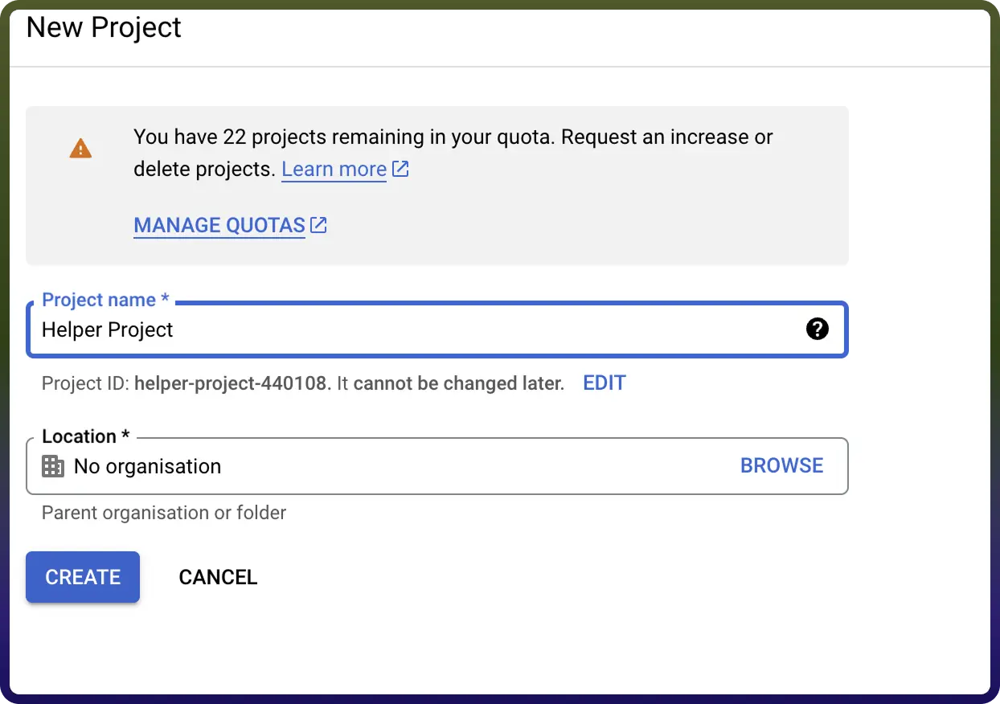
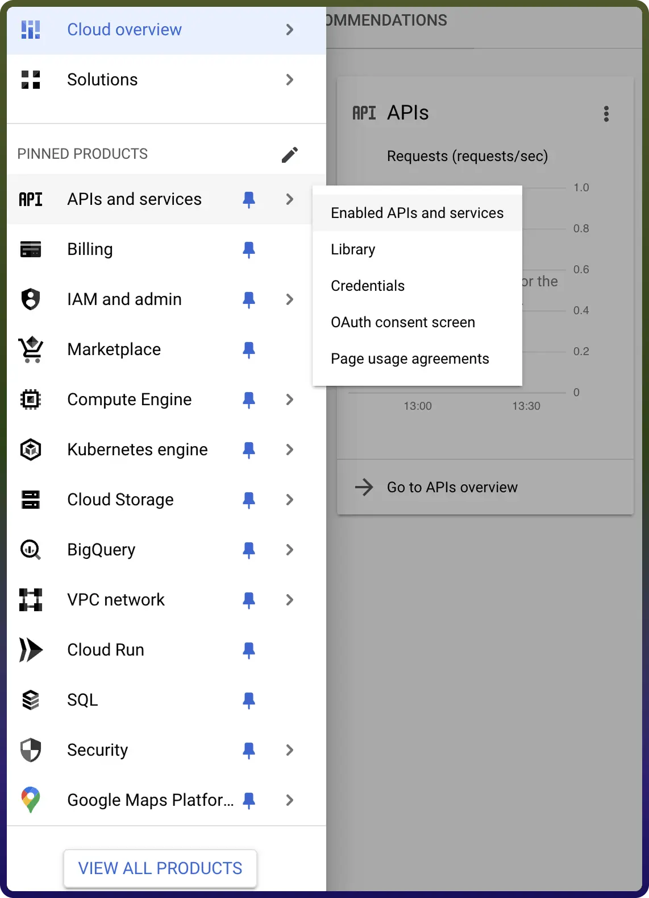
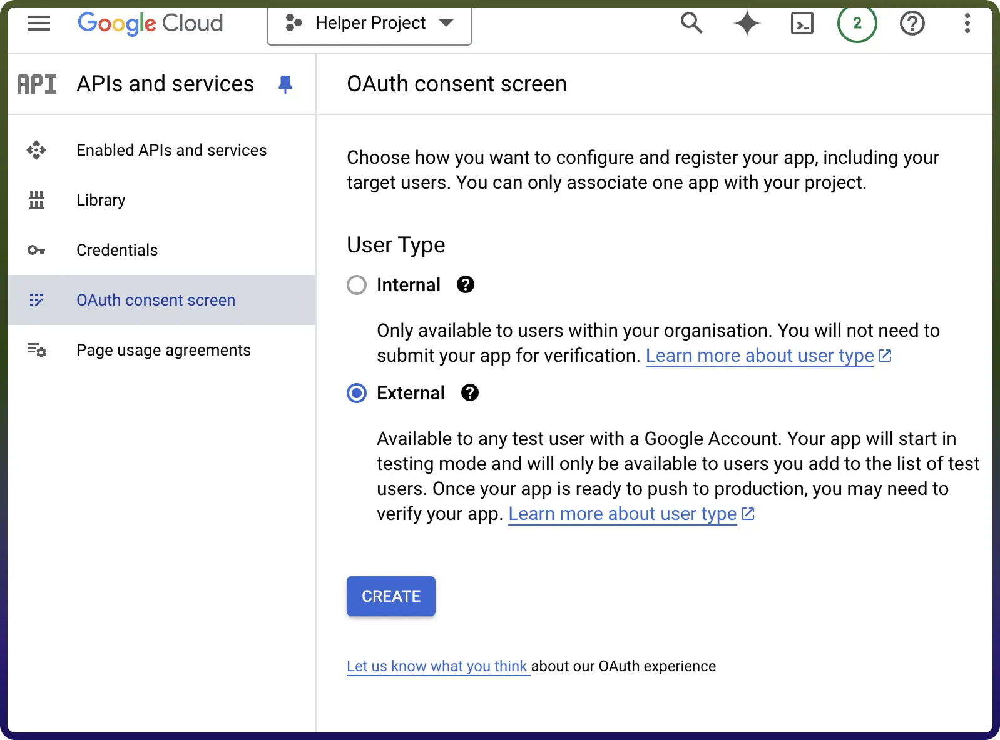
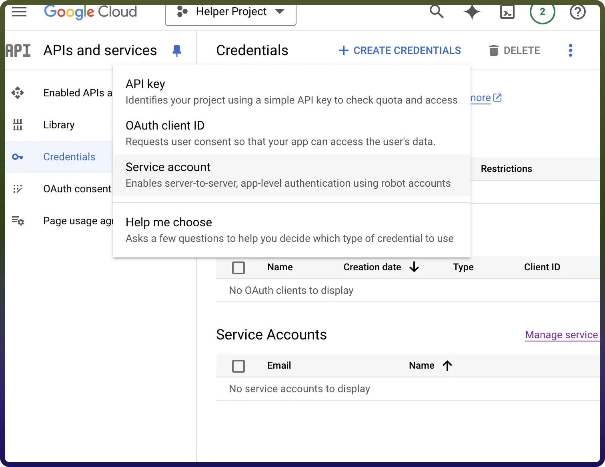
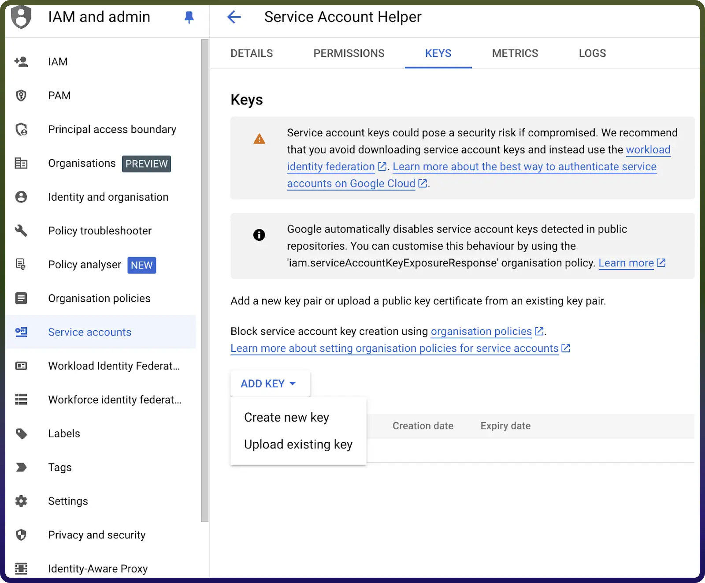

# Google Big Query integration | connect with UnifyApps

Source: https://www.unifyapps.com/docs/unify-integrations/google-big-query
Section: integrations

---

Integrating your application with Google BigQuery transforms your data strategy by centralizing massive datasets into a high-performance, serverless data warehouse. BigQuery enables teams to execute complex analytical queries in seconds, leverage built-in machine learning, and drive real-time insights—all while maintaining enterprise-grade security and seamless scalability.

## Authentication:

Before you begin, ensure you have the following information:

- `Connection Name`: Choose a descriptive name for your Google big query connection to help you identify it within your application or integration settings. A meaningful name, like "MyAppGoogleBigQueryIntegration," helps maintain organization, especially when managing multiple integrations.
- `Authentication Type`: Select the type of authentication to connect to your Google bigquery account securely:

##### **Service Account Based Authentication**

Create a service account by following these steps.

1. Go to [Google console](https://console.developers.google.com/) and sign in with your google account
2. Create a project under **IAM & Admin**->**Manage Resources** under menu section
3. Enter the project name and click on **Create**

4.

  

4.To Turn on the API services  for the service account go to APIs & Services -> Library  as shown below  
 Image1

5.Turn on `Google Big Query API` services here for your service account

6.Set up oAuth consent screen to configure OAuth consent for your application,Go to `APIs & Services -> OAuth consent screen`

7.Select the userType and details like Appname, User support email and developer contact information and click on save as shown below

8) Create a service account By clicking on APIs & Services -> Credentials  on menu

9) Click on create credentials -> Service Account and enter the service account name and description and press save and continue

10) To create a new key for your service account click on Keys -> Add Key, then select Create new key with JSON type, and save the downloaded private key JSON file as shown below

After you are done with creating the service account add domain-level access to the service account (based on client ID) by following these [**steps**](https://developers.google.com/cloud-search/docs/guides/delegation#delegate_domain-wide_authority_to_your_service_account). (either by logging in as super administrator or giving your service account details to super administrator)

- Use the service account email, private key, and a sample user email to authenticate the connection.

##### **OAuth Based Authentication**

The OAuth  method involves signing in with your Google account credentials on Google's Single Sign-On page, and granting the necessary permissions to UnifyWorkflows, For **OAuth**-based authentication, you'll need to perform the following steps to generate access credentials:

- Create an Oauth Credentials by following these steps.
- Go to [Google console](https://console.developers.google.com/) and sign in with your google account.
- Create a project under **IAM & Admin**->**Manage Resources** under the Menu section.
- Enter the project name and click on **Create**

- To Turn on the API services for the OAuth Client ID go to APIs & Services -> Library as shown below

- Turn on Google Big Query API services here for your OAuth Client ID authentication.
- Set up oAuth consent screen to configure OAuth consent for your application,Go to APIs & Services -> OAuth consent screen
- Select the userType and details like Appname, User support email and developer contact information and click on save as shown below
- Create a OAuth client ID By clicking on APIs & Services -> Credentials on menu
- Click on create credentials -> OAuth client ID.
- Create a new **web client** by Name in OAuth 2.0 Client IDs.
- Collect the Client ID and Client secret and store it.
- The Redirect url of Unify Apps ([Redirect URL for Unify apps](https://webhooks-global.ext-alb.qa.unifyapps.com/api/connector-auth-callback/oauthflowName=GeneralOAuthFlow)) , use this url and register this in `Authorization redirect URls`
- Using the Client ID and Client secret ,press the Authorise button. You’ll be redirected to a Google sign-in page.
- If you're not already logged into Google, enter your Google account credentials and Sign in.
- Google will display a permissions request screen, showing the app name and the specific Google services we are requesting access to (e.g., Google Big Query).
- Carefully review the permissions being requested. If you’re comfortable with them, click the "Allow" or "Grant Access" button.
- After granting access, you will be automatically redirected back to our platform, where you should see a confirmation message indicating that your Google account is now connected and authorized.

Ensure that the following permissions are granted for OAuth authentication and provide public access to your data in Google BigQuery.

| **Scope Code** | **Description** |
|---|---|
| `https://www.googleapis.com/auth/cloud-platform` | Full access to all Google Cloud Platform services. This is a "god-mode" scope for GCP and should be used sparingly. |
| `https://www.googleapis.com/auth/bigquery` | Full management access to BigQuery. Allows the app to create, delete, and modify datasets and tables, as well as run queries. |
| `https://www.googleapis.com/auth/bigquery.insertdata` | Stream data only. Allows the app to insert/stream data into BigQuery tables, but does not allow deleting or managing the table schema. |

## Actions :

| **Action Name** | **Description** |
|---|---|
| `Check export job status` | Check the status of an export job in Google Big Query |
| `Execute SQL query` | Execute SQL query in Google Big Query |
| `Export table data` | Export table data from Google Big Query to Google Cloud Storage |
| `Get table schema` | Get table schema in Google Big Query |
| `Insert multiple rows in table` | Insert multiple rows in table in Google Big Query |
| `Insert row in table` | Insert row in table in Google Big Query |
| `List tables` | List tables in Google Big Query |

.
