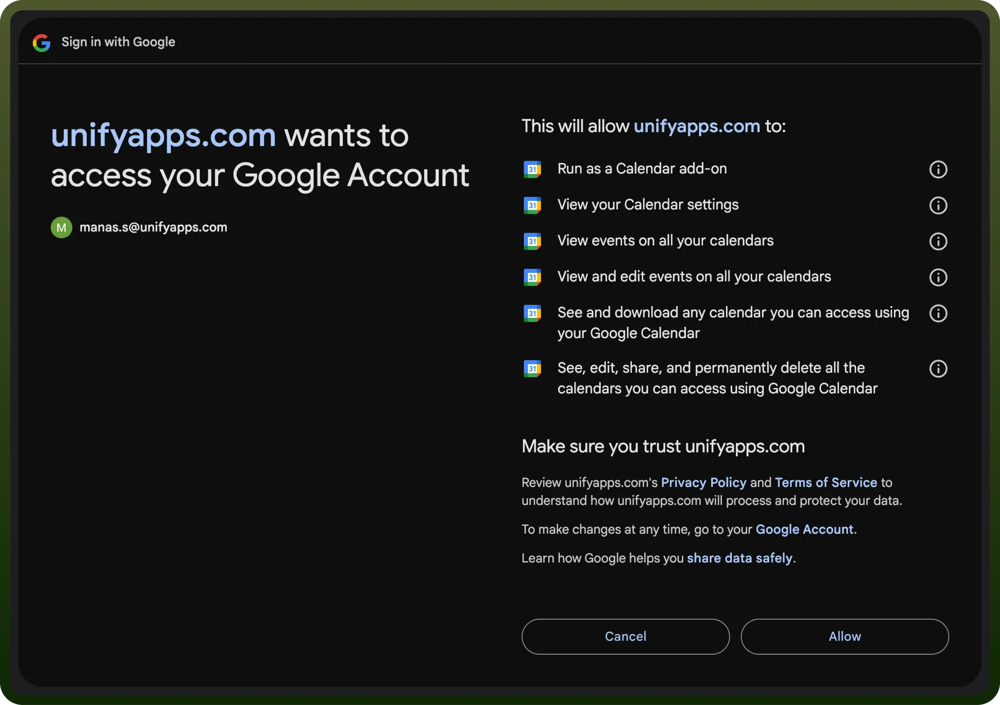

# Google calendar integration | connect with UnifyApps

Source: https://www.unifyapps.com/docs/unify-integrations/google-calendar
Section: integrations

---

Google Calendar is a cloud-based calendar service that allows users to schedule events, set reminders, and share calendars.

Integrating your application with Google Calendar enhances event management and collaboration capabilities, providing a powerful tool for streamlined scheduling and organization.

## Authentication

Ensure you have the following information ready for a seamless integration process:

- `Connection Name`**:** Select a descriptive name for your connection, like "MyAppCalendarIntegration." This helps easily identify the connection within your application or integration settings.
- `Authentication Type`**:** Google Calendar supports service accounts and OAuth authentication for server-to-server integrations.
  - **Service Account**
  - **OAuth**

### Service Account

- `Create a Service Account`**:** Follow the Google Cloud Platform instructions to create a service account.
- `Add Domain-Level Access`**:** Grant domain-level access to the service account using the client ID, following the steps provided by Google.
- `Scopes`**:** Ensure the following scopes are added to your service account and domain-level access:
  - https://www.googleapis.com/auth/calendar
  - https://www.googleapis.com/auth/calendar.readonly
  - https://www.googleapis.com/auth/calendar.events
- `Authentication`**:** Use the service account email, private key, and a sample user email to authenticate the connection.

### OAuth

- Press the `Authorize` button in your application. You'll be redirected to a Google sign-in page.
- If you're not already logged into Google, enter your Google account credentials.
- Google will display a permissions request screen, showing your app name and the specific Google services requested (e.g., Google Calendar).
- Carefully review the permissions being requested. If you're comfortable with the permissions, click the "`Allow`" or "`Grant Access`" button.
- After granting access, you'll be automatically redirected back to your platform, and you should see a confirmation message that your Google account is now connected.

  

## Actions

| **Action Name** | **Description** |
|---|---|
| `Create all day event` | Creates an all-day event in Google Calendar |
| `Create calendar` | Creates a calendar in Google Calendar |
| `Create event` | Creates a new event in Google Calendar |
| `Create task` | Creates a task in a tasklist in Google Calendar |
| `Delete event` | Deletes an event via its Event ID in Google Calendar |
| `Free-Busy Times` | Checks for free-busy times in Google Calendar |
| `Get calendar by ID` | Gets calendar by ID from Google Calendar |
| `Get event by ID` | Gets event by ID from Google Calendar |
| `List calendars` | Lists calendars in Google Calendar |
| `Update event` | Updates an event in Google Calendar |
| `Update task` | Updates a task in Google Calendar |
| `Search events` | Searches events in Google Calendar |
| `Add attendees to an event` | Adds a list of attendees to an event in Google Calendar |
| `Delete attendees from an event` | Deletes a list of attendees from an event in Google Calendar |

## Triggers

| **Trigger Name** | **Description** |
|---|---|
| `New/Updated event` | Triggers when an event is created or updated in a specific calendar |
| `New event` | Triggers when a new event is created in a specific calendar |
| `Event end` | Triggers when an event ends |
| `Event start` | Triggers at or a specified time before an event starts |
