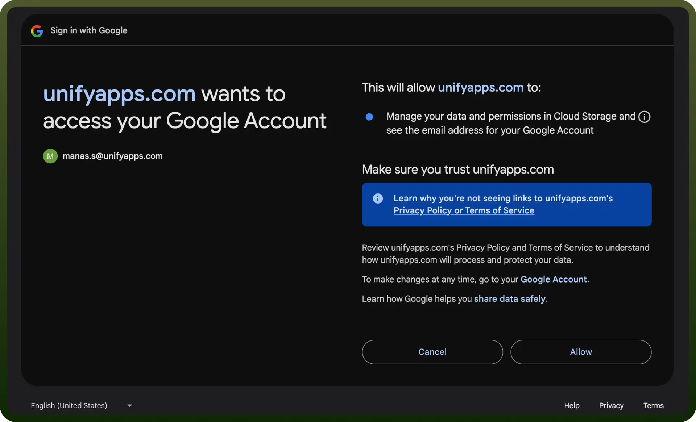

# Google Cloud Storage

Source: https://www.unifyapps.com/docs/unify-integrations/google-cloud-storage
Section: integrations

---

Google Cloud Storage is a scalable, secure, and highly available object storage service for storing and retrieving any amount of data at any time.

Integrating your application with PagerDuty allows you to automate workflows, manage incidents efficiently, and gain real-time visibility into your system.

## Authentication

Ensure you have the following information ready for a seamless integration process:

- `Connection Name`**:** Select a descriptive name for your connection, like "MyAppGCSIntegration". This helps in easily identifying the connection within your application or integration settings.
- `Authentication Type`**:** Google Cloud services support two main authentication methods:
  - **Service Account Authentication:** For server-to-server integrations, allowing admins to take actions within Google Cloud services without user interference.
  - **OAuth 2.0 Authentication:** For user-centric applications, allowing users to grant access to their Google Cloud resources.

### Service account

- Create a service account by following these [steps](https://apps.google.com/supportwidget/articlehome?hl=en&article_url=https%3A%2F%2Fsupport.google.com%2Fa%2Fanswer%2F7378726%3Fhl%3Den&assistant_id=generic-unu&product_context=7378726&product_name=UnuFlow&trigger_context=a).
- Add domain level access to the service account (basis client ID) by following these [steps](https://developers.google.com/cloud-search/docs/guides/delegation#delegate_domain-wide_authority_to_your_service_account).
- Ensure that below scopes are added within your service account and domain level access: [https://www.googleapis.com/auth/devstorage.full_control](https://www.googleapis.com/auth/devstorage.full_control) [https://www.googleapis.com/auth/devstorage.read_only](https://www.googleapis.com/auth/devstorage.read_only) [https://www.googleapis.com/auth/devstorage.read_write](https://www.googleapis.com/auth/devstorage.read_write)
- Use service account email and private key along with an user email to authenticate the connection

  

### OAuth 2.0

Set up OAuth 2.0 credentials in the Google Cloud Console:

- Go to the [Google Cloud Console](https://console.cloud.google.com/).
- Select your project and navigate to "`APIs & Services`" > "`Credentials`".
- Click "`Create Credentials`" and choose "`OAuth client ID`".
- Select the appropriate application type (e.g., Web application, Desktop app).
- Configure the OAuth consent screen with necessary information.
- Add authorized redirect URIs for your application.
- Once created, note down the Client ID and Client Secret.

  

## Actions

| **Action** | **Description** |
|---|---|
| `Create a bucket` | Creates a bucket in Google Cloud Storage |
| `Delete a bucket` | Deletes a bucket by its name in Google Cloud Storage |
| `Delete an object` | Deletes an object by its name  in Google Cloud Storage |
| `Download an object` | Downloads an object from a bucket in Google Cloud Storage |
| `Get a bucket` | Gets a bucket by its name in Google Cloud Storage |
| `Get an object metadata` | Gets object metadata in Google Cloud Storage |
| `List buckets` | Lists buckets by project ID in Google Cloud Storage |
| `List objects` | Lists objects within a bucket in Google Cloud Storage |
| `Update a bucket` | Updates a bucket by its name in Google Cloud Storage |
| `Update an object metadata` | Updates object metadata by its name in Google Cloud Storage |
| `Upload an object` | Uploads an object to a bucket in Google Cloud Storage |
