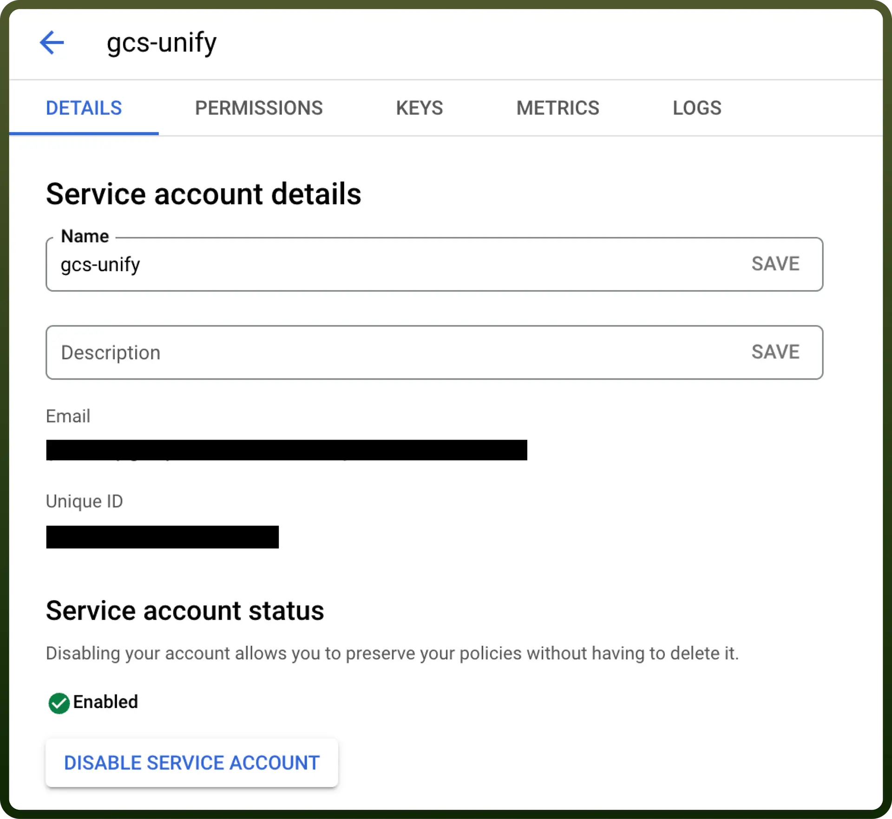
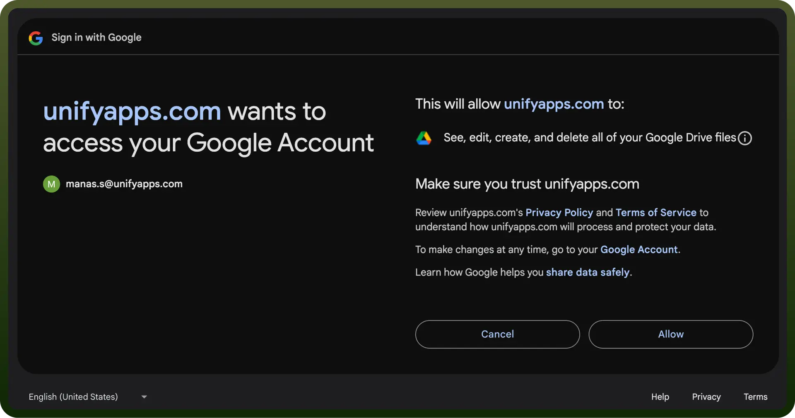

# Google Drive integration

Source: https://www.unifyapps.com/docs/unify-integrations/google-drive
Section: integrations

---

Using Google Drive simplifies file storage and sharing while enhancing collaboration. It allows users to easily upload, store, and organize documents in the cloud, making them accessible from any device.

Connecting your application to a Google Drive account enables integration for file storage, sharing, and collaborative work.

## Authentication

Before you begin, make sure you have the following information:

- `Connection Name`**:** Choose a meaningful name for your connection. This name helps you identify the connection within your application or integration settings. It could be something descriptive like "MyAppGoogleDriveIntegration".
- `Authentication Type`**:** Select the type of authentication for connecting to your Google Drive account:
  - OAuth 2.0 based
  - Service account based

### Service Account Based Authentication

- Create a service account by following these [steps](https://apps.google.com/supportwidget/articlehome?hl=en&article_url=https%3A%2F%2Fsupport.google.com%2Fa%2Fanswer%2F7378726%3Fhl%3Den&assistant_id=generic-unu&product_context=7378726&product_name=UnuFlow&trigger_context=a).
- Add domain-level access to the service account (based on client ID) by following these [steps](https://developers.google.com/cloud-search/docs/guides/delegation#delegate_domain-wide_authority_to_your_service_account).
- Ensure that the following scopes are added to your service account and domain-level access:
  - [https://www.googleapis.com/auth/drive](https://www.googleapis.com/auth/drive)
  - [https://www.googleapis.com/auth/drive.file](https://www.googleapis.com/auth/drive.file)
- While creating a connection select the authentication type as service account.
- Enter the connection name, service account email, private key and user email. Then click on create. A connection will be made using a service account.

  

### OAuth Based Authentication

The OAuth  method involves signing in with your Google account credentials on Google's Single Sign-On page, and granting the necessary permissions to UnifyWorkflows, For **OAuth**-based authentication, you'll need to perform the following steps to generate access credentials:

1. Click on the `Authorise` button. You’ll be redirected to a Google sign-in page.
2. If you're not already logged into Google, enter your Google account credentials and Sign in.
3. Google will display a permissions request screen, showing the app name and the specific Google services we are requesting access to google drive permissions.
4. Carefully review the permissions being requested. If you’re comfortable with them, click the "`Allow`" button.
5. After granting access, you will be automatically redirected back to our platform, where you should see a confirmation message indicating that your Google account is now connected.

  

## Actions

| Action | Description |
|---|---|
| `Add permissions to a file` | Add permissions to a file in google drive |
| `Copy file` | Copy file in google drive |
| `Delete file` | Delete file from google drive |
| `Export file` | Export a fiile in google drive |
| `Get permission of a file` | Get permission of a particular file in google drive |
| `List permissions of a file` | List permissions of a file in google drive |
| `Create folder` | Create folder in google drive |
| `Update permission of a file` | Update permission of a particular file in google drive |
| `Remove permissions from a file` | Remove permissions from a file in google drive |
| `Rename or move file/folder` | Rename/move file or folder in google drive |
| `Download files` | Download contents of a file in google drive |
| `Search files or folders` | Retrieve a list of files or folders that matches your search criteria |
| `Upload file` | Upload file of any size to google drive |

## Triggers

| Triggers | Descriptions |
|---|---|
| `New file or folder` | Triggers when new file or folder is created |
| `New CSV file` | Triggers when a CSV file is added and processes CSV lines in batches |
| `New activity` | New activity in google drive |
| `New file or folder in folder hierarchy` | Triggers when a new file folder is created in a folder or its subfolders |
