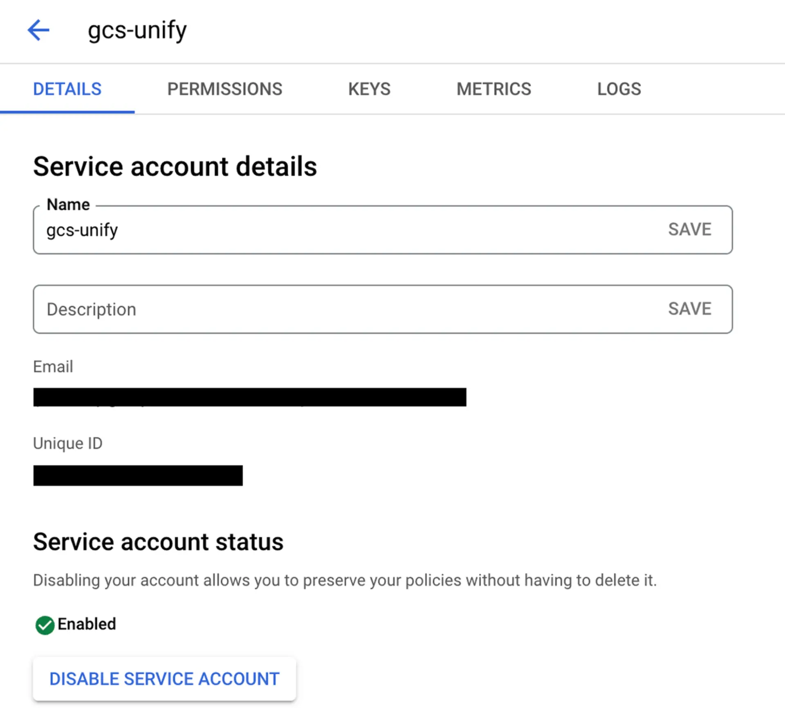

# Google Forms integration

Source: https://www.unifyapps.com/docs/unify-integrations/google-forms
Section: integrations

---

# Google Forms

Google Forms integration allows your application to seamlessly collect, manage, and analyze data within Google Workspace. Using secure authentication and the Google Forms API, you can programmatically create forms, add or update questions, collect responses, and trigger automated workflows based on submissions.

### Authentication:

Connecting your application with Google Forms enables you to utilize its APIs to dynamically create surveys, manage questions, retrieve responses, and trigger actions based on submitted data. Before you begin, ensure you have the following information:

`Connection Name` : Choose a meaningful name for your connection. This name helps you identify the connection within your application or integration settings. It could be something descriptive like "MyAppGoogleFormsIntegration".

`Authentication Type` : Google Chat supports three types of authentications. They are :

- Service Account
- OAuth with Client Credentials
- OAuth

Create a Project in Google Cloud Console :  Visit [Google Cloud Console](https://console.cloud.google.com/) to create a project.

### Service Account Based:

1. Create a service account by following these [steps](https://docs.cloud.google.com/iam/docs/service-accounts-create).
2. Add domain-level access to the service account (based on client ID) by following these [steps](https://developers.google.com/cloud-search/docs/guides/delegation#delegate_domain-wide_authority_to_your_service_account).
3. Use the service account email, private key, required scopes, and a sample user email to authenticate the connection.

### OAuth with Client Credentials Based:

1. Create an OAuth Client Credentials by following these [steps](https://support.google.com/cloud/answer/6158849?hl=en#).
2. Select the scopes required.
3. Use the Client ID and Client secret generated, press the Authorise button. You’ll be redirected to a Google sign-in page.
4. Google will display a permissions request screen, showing the app name and the specific Google services we are requesting access to.
5. Carefully review the permissions being requested. If you’re comfortable with them, click the "Allow" or "Grant Access" button.
6. If you're not already logged into Google, enter your Google account credentials and Sign in.
7. After granting access, you will be automatically redirected back to our platform, where you should see a confirmation message indicating that your Google account is now connected and authorized.

### **OAuth Based :**

1. Press the Authorise button. You'll be redirected to a Google sign-in page .
2. If you're not already logged into Google, enter your Google account credentials.
3. Google will display a permissions request screen. You'll see our app name and the specific Google services we request access to.
4. Carefully review the permissions we're asking for. If you're comfortable with the permissions, click the "Allow" or "Grant Access" button.
5. After granting access, you'll be automatically redirected back to our platform. You should see a confirmation message that your Google account is now connected.

### SCOPES :

| Scope code | Description |
|---|---|
| https://www.googleapis.com/auth/forms.body | See, edit, create, and delete the content and structure of your Google Forms. |
| https://www.googleapis.com/auth/forms.body.readonly | View the content and structure of your Google Forms. |
| https://www.googleapis.com/auth/forms.responses.readonly | View responses from your Google Forms. |

### **ACTIONS :**

| **Action Name** | **Description** |
|---|---|
| `Add questions` | Adds questions in Google Forms |
| `Create form` | Creates a form in Google Forms |
| `Get records` | Gets form records from Google Forms |
| `List form responses` | List responses for a form in Google Forms |
| `Search record` | Searches for records in Google Forms |

### **TRIGGERS :**

| **Trigger Name** | **Description** |
|---|---|
| `On forms responses` | Triggers when a response was submitted in Google Forms |
