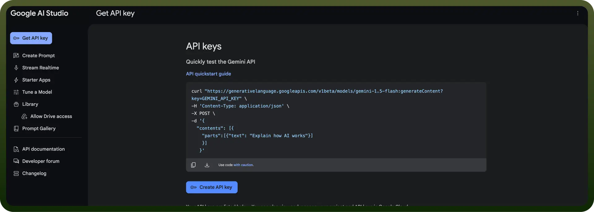

# Google Gemini AI integration | connect with UnifyApps

Source: https://www.unifyapps.com/docs/unify-integrations/google-gemini-ai
Section: integrations

---

Google Gemini AI is a powerful generative AI model designed for multimodal capabilities, enabling seamless interaction across text, images, and more. It leverages advanced reasoning and contextual understanding to deliver versatile and human-like responses.

Integrating Google Gemini AI enhances productivity with advanced multimodal capabilities, enabling seamless and intelligent user experiences.

## Authentication

Before integrating, ensure you have the following information:

- `Connection Name`: Choose a descriptive name for your connection to help you identify it within your application or integration settings. A meaningful name, like "MyAppGeminiIntegration," helps maintain organization, especially when managing multiple integrations.
- `Authentication Type`: Gemini provides authentication using an api token.

### API Token Based Authentication

- Visit[Google AI Studio](https://aistudio.google.com/app/apikey) and sign in with your Google account.
- Click on the “`Gemini API`” tab or the “`Learn more about the Gemini API`” button.
- Click on the “`Get API key in Google AI Studio`” button on the Gemini API page.
- Review and accept the Google APIs Terms of Service and Gemini API Additional Terms of Service. Optionally, opt-in for updates and research study participation.
- Click “`Create API key`” and choose whether to create it in a new or existing project. Your API key will be auto-generated—store it securely.

  

## Actions

| **Action** | **Description** |
|---|---|
| `Send messages to Gemini models` | Converse with Gemini models |
| `Analyze image` | Analyze image and based on the provided question |
| `Analyze text` | Contextual analysis of text to answer user-provided questions |
| `Categorize text` | Classify text based on user-defined categories |
| `Draft email` | Generate an email based on user description |
| `Generate text embedding` | Generate text embedding for the inputted text |
| `Parse text` | Extract structured data from freeform text |
| `Summarize text` | Get a summary of the input text in configurable length |
| `Translate text` | Translate text between languages |
