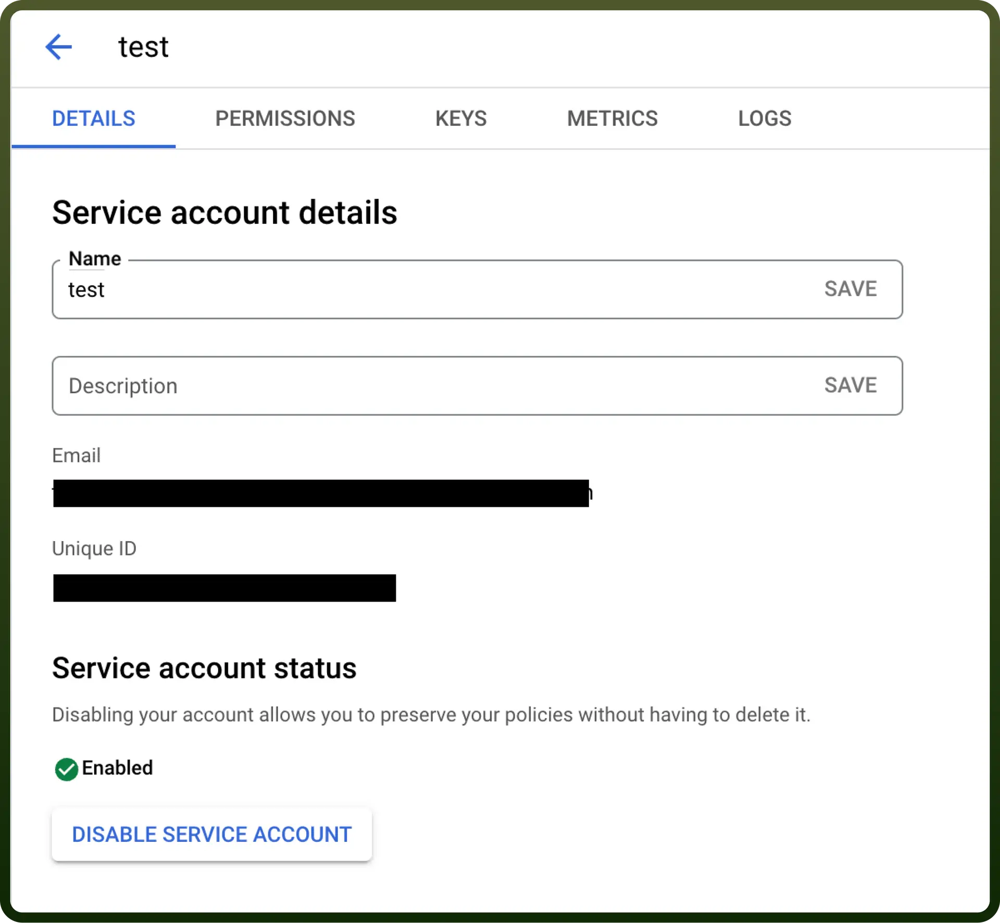
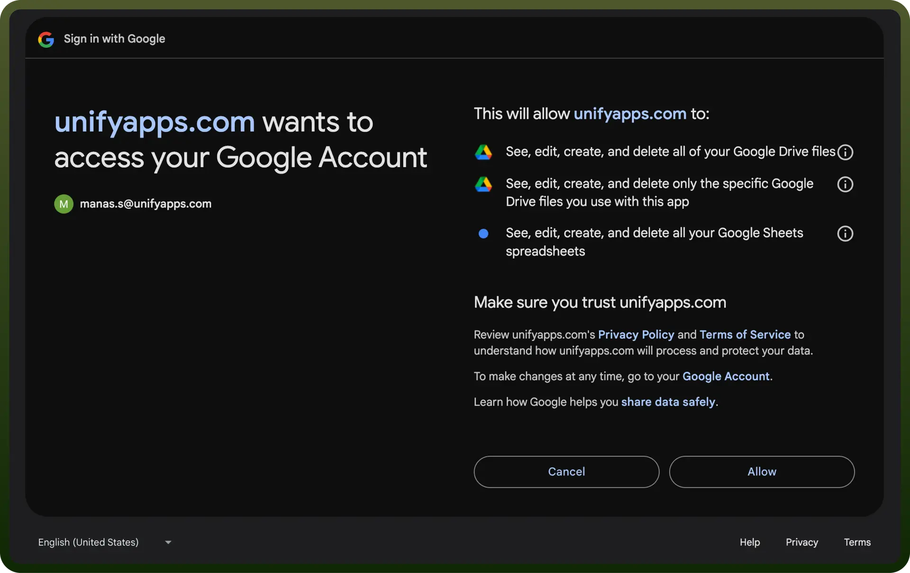

# Google Sheets integration | connect with UnifyApps

Source: https://www.unifyapps.com/docs/unify-integrations/google-sheets
Section: integrations

---

Google Sheets is a cloud-based spreadsheet tool that supports data **organization**, **analysis**, and **collaboration**.

Integrating your application with Google Sheets revolutionises data management, offering powerful spreadsheet functionality for streamlined organisation, analysis, and collaboration.

## Authentication

Ensure you have the following information ready for a seamless integration process:

- `Connection Name`: Select a descriptive name for your connection, like "MyAppsheetsIntegration". This helps easily identify the connection within your application or integration settings.
- `Authentication Type`: Google Sheets supports service accounts and OAuth authentication for server-to-server integrations. This would allow admins to take actions within Google Sheets without user interference.

### Service Account

- Create a service account by following these [steps](https://apps.google.com/supportwidget/articlehome?hl=en&article_url=https%3A%2F%2Fsupport.google.com%2Fa%2Fanswer%2F7378726%3Fhl%3Den&assistant_id=generic-unu&product_context=7378726&product_name=UnuFlow&trigger_context=a).
- Add domain-level access to the service account (based on client ID) by following these [steps](https://developers.google.com/cloud-search/docs/guides/delegation#delegate_domain-wide_authority_to_your_service_account).
- Ensure that the following scopes are added to your service account and domain-level access:
  - [https://www.googleapis.com/auth/spreadsheets](https://www.googleapis.com/auth/spreadsheets)
  - [https://www.googleapis.com/auth/drive](https://www.googleapis.com/auth/drive)
  - [https://www.googleapis.com/auth/drive.file](https://www.googleapis.com/auth/drive.file)
- Use the service account email, private key, and a sample user email to authenticate the connection.

  

### OAuth

- Press the `Authorize` button. You'll be redirected to a Google sign-in page.
- If you're not already logged into Google, enter your Google account credentials.
- Google will display a permissions request screen. You'll see our app name and the specific Google services we request access to (e.g., Google Drive and Google Sheets).
- Carefully review the permissions we're asking for. If you're comfortable with the permissions, click the "`Allow`" or "`Grant Access`" button.
- After granting access, you'll be automatically redirected back to our platform. You should see a confirmation message that your Google account is now connected.

  

## Actions

| **Action Name** | **Description** |
|---|---|
| `Add multiple rows` | Adds multiple rows to a sheet in Google Sheets |
| `Add a row` | Adds a row to the specified sheet in Google Sheets |
| `Copy sheet` | Copies a sheet from one Google Sheet to another |
| `Create sheet` | Creates a new sheet in Google Sheets |
| `Create column` | Creates a new column in Google Sheets |
| `Create spreadsheet` | Creates a new spreadsheet in Google Sheets |
| `Delete a row` | Deletes a row in a sheet in Google Sheets |
| `Get rows` | Gets rows from a spreadsheet in Google Sheets |
| `Get spreadsheet metadata` | Gets metadata for spreadsheet in Google Sheets |
| `Search rows` | Search rows in a sheet in Google Sheets |
| `Update a row` | Updates a row in a sheet in Google Sheets |
| `Update rows` | Updates rows in a sheet in Google Sheets |

## Triggers

| **Trigger Name** | **Description** |
|---|---|
| `New row in sheet in My Drive` | Triggers when a row is added to a sheet in your My Drive |
| `New row in sheet in My Drive (Real-time)` | Triggers when a row is added to a sheet in your My Drive, in real-time |
| `New row in sheet in Team Drive` | Triggers when a row is added to a sheet in a Team Drive |
| `New/updated row in sheet in My Drive` | Triggers when a row is added or updated in a sheet in your My Drive |
| `New/updated row in sheet in My Drive (Real-time)` | Triggers when a row is added or updated in a sheet in your My Drive, in real-time |
| `New/updated row in sheet in Team Drive` | Triggers when a row is added or updated in a sheet in a Team Drive. |
