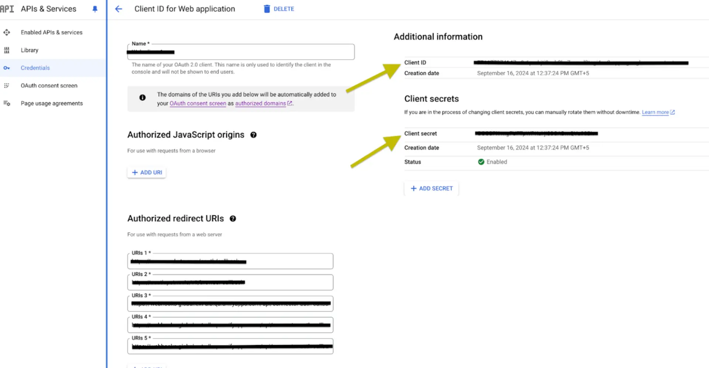

# Google Slides integration | connect with UnifyApps

Source: https://www.unifyapps.com/docs/unify-integrations/google-slides
Section: integrations

---

# Google Slides

Google Slides integration allows your application to seamlessly create, manage, and present dynamic content within Google Workspace. Using secure authentication and the Google Slides API, you can programmatically create presentations, add or update slides, insert text, images, and shapes, and automate presentation workflows.

### Authentication:

Connecting your application with Google Slides enables you to utilize its APIs to dynamically create presentations, manage slides, update content, and automate workflows. Before you begin, ensure you have the following information:

`Connection Name` : Choose a meaningful name for your connection. This name helps you identify the connection within your application or integration settings. It could be something descriptive like "MyAppGoogleSlidesIntegration".

`Authentication Type` : Google Slides supports three types of authentications. They are :

- Service Account
- OAuth with Client Credentials
- OAuth

Create a Project in Google Cloud Console :  Visit [Google Cloud Console](https://console.cloud.google.com/) to create a project.

#### Service Account Based:

1. Create a service account by following these [steps](https://docs.cloud.google.com/iam/docs/service-accounts-create).
2. Add domain-level access to the service account (based on client ID) by following these [steps](https://developers.google.com/cloud-search/docs/guides/delegation#delegate_domain-wide_authority_to_your_service_account).
3. Use the service account email, private key, required scopes, and a sample user email to authenticate the connection.

#### OAuth with Client Credentials Based:

1. Create an OAuth Client Credentials by following these [steps](https://support.google.com/cloud/answer/6158849?hl=en#).
2. Select the scopes required.
3. Use the Client ID and Client secret generated, press the Authorise button. You’ll be redirected to a Google sign-in page.
4. If you're not already logged into Google, enter your Google account credentials and Sign in.
5. Google will display a permissions request screen, showing the app name and the specific Google services we are requesting access to.
6. Carefully review the permissions being requested. If you’re comfortable with them, click the "Allow" or "Grant Access" button.
7. After granting access, you will be automatically redirected back to our platform, where you should see a confirmation message indicating that your Google account is now connected and authorized.

#### **OAuth Based :**

1. Press the Authorize button. You'll be redirected to a Google sign-in page .
2. If you're not already logged into Google, enter your Google account credentials.
3. Google will display a permissions request screen. You'll see our app name and the specific Google services we request access to.
4. Carefully review the permissions we're asking for. If you're comfortable with the permissions, click the "Allow" or "Grant Access" button.
5. After granting access, you'll be automatically redirected back to our platform. You should see a confirmation message that your Google account is now connected.

### SCOPES :

| Scope code | Description |
|---|---|
| https://www.googleapis.com/auth/presentations | View and manage Google Slides presentations |
| https://www.googleapis.com/auth/drive | View and manage all Google Drive files |
| https://www.googleapis.com/auth/drive.file | View and manage Google Drive files created or opened by this app |

### **ACTIONS :**

| **Action Name** | **Description** |
|---|---|
| `Add speaker notes` | Add or update speaker notes for a specific slide in Google Slides |
| `Create presentation` | Creates a presentation in Google Slides |
| `Create slide` | Creates slides and performs batch updates in Google Slides presentation |
| `Get metadata` | Get metadata of presentations in Google Slides |
| `Get presentation` | Gets an existing presentation from Google Slides |
| `Get slides` | Get information about slides in Google Slides |
| `List file permissions` | Lists the permissions for a presentation in Google Slides |
| `Update slide` | Batch updates to a Google Slides presentation including creating slides |
