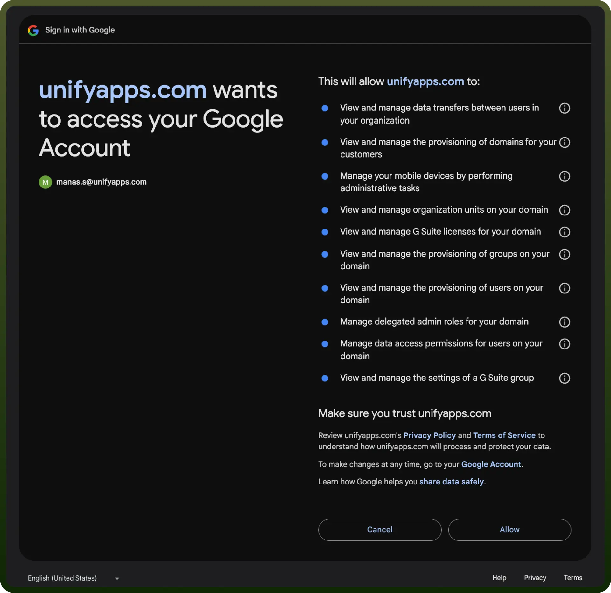

# Google Workspace integration | connect with UnifyApps

Source: https://www.unifyapps.com/docs/unify-integrations/google-workspace
Section: integrations

---

Google Workspace is a cloud-based productivity suite offering tools like Gmail, Docs, Drive, and Meet for seamless collaboration and communication. It integrates securely across devices, enhancing teamwork and efficiency for individuals and businesses.

Integrating Google Workspace boosts productivity by enabling real-time collaboration, secure file sharing, and streamlined communication across tools like Gmail, Drive, and Meet.

## Authentication

Before integrating Gmail, ensure you have the following information:

- `Connection Name`: Choose a descriptive name for your Gmail connection to help you identify it within your application or integration settings. A meaningful name, like "MyAppGoogleWorkspaceIntegration," helps maintain organization, especially when managing multiple integrations.
- `Authentication Type`: Select the type of authentication to connect to your Gmail account securely:
  - OAuth
  - Service Account Authentication

### OAuth Based Authentication

The OAuth  method involves signing in with your Google account credentials on Google's Single Sign-On page, and granting the necessary permissions to UnifyWorkflows, For **OAuth-based authentication**, you'll need to perform the following steps to generate access credentials:

1. Click on the `Authorise` button. You’ll be redirected to a Google sign-in page.
2. If you're not already logged into Google, enter your Google account credentials and Sign in.
3. Google will display a permissions request screen, showing the app name and the specific Google services we are requesting access to “`Read, compose, send, and permanently delete all your email from Gmail`” and “`Send email on your behalf`”.
4. Carefully review the permissions being requested. If you’re comfortable with them, click the "`Allow`" button.
5. After granting access, you will be automatically redirected back to our platform, where you should see a confirmation message indicating that your Google account is now connected.

  

### Service Account Based Authentication

- Create a service account by following these [steps](https://apps.google.com/supportwidget/articlehome?hl=en&article_url=https%3A%2F%2Fsupport.google.com%2Fa%2Fanswer%2F7378726%3Fhl%3Den&assistant_id=generic-unu&product_context=7378726&product_name=UnuFlow&trigger_context=a).
- Add domain-level access to the service account (based on client ID) by following these [steps](https://developers.google.com/cloud-search/docs/guides/delegation#delegate_domain-wide_authority_to_your_service_account).
- Ensure that the following scopes are added to your service account and domain-level access:
  - [https://www.googleapis.com/auth/admin.directory.user](https://www.googleapis.com/auth/admin.directory.user)
  - [https://www.googleapis.com/auth/admin.directory.group](https://www.googleapis.com/auth/admin.directory.group)
  - [https://www.googleapis.com/auth/admin.directory.orgunit](https://www.googleapis.com/auth/admin.directory.orgunit)
  - [https://www.googleapis.com/auth/admin.directory.rolemanagement](https://www.googleapis.com/auth/admin.directory.rolemanagement)
  - [https://www.googleapis.com/auth/admin.directory.user.security](https://www.googleapis.com/auth/admin.directory.user.security)
  - [https://www.googleapis.com/auth/apps.groups.settings](https://www.googleapis.com/auth/apps.groups.settings)
  - [https://www.googleapis.com/auth/admin.directory.device.mobile.action](https://www.googleapis.com/auth/admin.directory.device.mobile.action)
  - [https://www.googleapis.com/auth/admin.datatransfer](https://www.googleapis.com/auth/admin.datatransfer)
  - [https://www.googleapis.com/auth/apps.licensing](https://www.googleapis.com/auth/apps.licensing)
  - [https://www.googleapis.com/auth/admin.directory.domain](https://www.googleapis.com/auth/admin.directory.domain)
- Use the service account email, private key, and a sample user email to authenticate the connection.

  

## Actions

| **Action** | **Description** |
|---|---|
| `Add group` | Adds a group in Google Workspace |
| `Add license` | Assigns a license in Google Workspace |
| `Add member to group` | Adds a member to a group in Google Workspace |
| `Add organizational unit` | Adds an organizational unit in Google Workspace |
| `Add role` | Adds a role in Google Workspace |
| `Add role assignment` | Adds a role assignment in Google Workspace |
| `Add user` | Adds a user in Google Workspace |
| `Add user alias` | Adds a user alias in Google Workspace |
| `Delete access token` | Deletes an access token in Google Workspace |
| `Delete app specific password` | Deletes an app-specific password in Google Workspace |
| `Delete group` | Deletes a group in Google Workspace |
| `Delete license` | Deletes a license assigned to a user in Google Workspace |
| `Delete member from group` | Deletes a member from a group in Google Workspace |
| `Delete mobile device` | Removes a mobile device in Google Workspace |
| `Delete organizational unit` | Deletes an organizational unit in Google Workspace |
| `Delete role` | Deletes a role in Google Workspace |
| `Delete role assignment` | Deletes a role assignment in Google Workspace |
| `Delete user` | Deletes a user in Google Workspace |
| `Delete user alias` | Deletes a user alias in Google Workspace |
| `Generate verification codes` | Generates new backup verification codes for a user in Google Workspace |
| `Get access token` | Gets an access token from Google Workspace |
| `Get app specific password` | Gets an app-specific password from Google Workspace |
| `Get group` | Gets a group from Google Workspace |
| `Get group settings` | Gets group settings from Google Workspace |
| `Get license` | Gets a license assigned to a user from Google Workspace |
| `Get member from group` | Gets a member from a group from Google Workspace |
| `Get organizational unit` | Gets an organizational unit from Google Workspace |
| `Get role` | Gets a role from Google Workspace |
| `Get role assignment` | Gets a role assignment from Google Workspace |
| `Get user` | Gets a user from Google Workspace |
| `Get verification codes` | Gets the current set of valid backup verification codes for a user from Google Workspace |
| `Invalidate verification codes` | Invalidates the current backup verification codes for a user in Google Workspace |
| `Mobile device action` | Takes an action that affects a mobile device in Google Workspace |
| `Search access token` | Searches for an access token in Google Workspace |
| `Search app specific password` | Searches for an app-specific password in Google Workspace |
| `Search group` | Searches for a group in Google Workspace |
| `Search license` | Searches for a license assigned to a user in Google Workspace |
| `Search member from group` | Searches for a member from a group in Google Workspace |
| `Search mobile device` | Searches for a mobile device in Google Workspace |
| `Search organizational unit` | Searches for an organizational unit in Google Workspace |
| `Search role` | Searches for a role in Google Workspace |
| `Search role assignment` | Searches for a role assignment in Google Workspace |
| `Search user` | Searches for a user in Google Workspace |
| `Search user alias` | Searches for a user alias in Google Workspace |
| `Transfer data` | Inserts a data transfer request in Google Workspace |
| `Update group` | Updates a group in Google Workspace |
| `Update group settings` | Updates group settings in Google Workspace |
| `Update license` | Reassigns a user's product SKU with a different SKU in the same product in Google Workspace |
| `Update member to group` | Updates a member to a group in Google Workspace |
| `Update organizational unit` | Updates an organizational unit in Google Workspace |
| `Update role` | Updates a role in Google Workspace |
| `Update user` | Updates a user in Google Workspace |
| `Update user to admin` | Updates a user to admin in Google Workspace |

## Triggers

| **Trigger** | **Description** |
|---|---|
| `Deleted user` | This trigger will be invoked when a new user is deleted |
| `New user` | This trigger will be invoked when a new user is created |
| `Updated user` | This trigger will be invoked when a new user is updated |
| `Updated user admin status` | This trigger will be invoked when a user's admin status is toggled |
| `User undeleted` | This trigger will be invoked when a user is undeleted |
