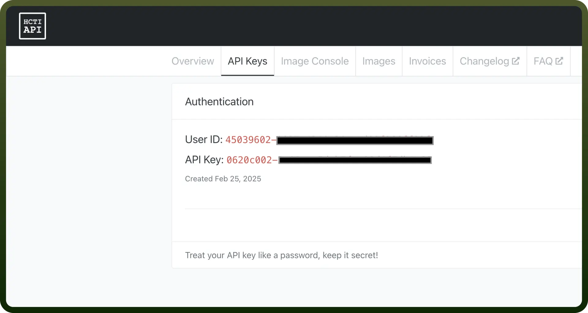

# HTML/CSS to Image

Source: https://www.unifyapps.com/docs/unify-integrations/html-css-to-image
Section: integrations

---

This HTML/CSS-to-Image API lets you render arbitrary HTML/CSS or web pages into shareable images via simple endpoints—Create Image (from markup or URL), Get Image, and Delete Image. It handles hosting, caching, and lifecycle of generated visuals so your app can focus on content, not rendering infrastructure.

Integrating this service automates on-the-fly image creation, ensuring pixel-perfect outputs across devices while offloading rendering complexity from your stack.

## Authentication

Before you begin, make sure you have the following information:

- `Connection Name`: Select a descriptive name for your connection, like "MyAppHTML/CSStoImageIntegration". This helps in easily identifying the connection within your application or integration settings.
- `Authentication Type`**:** HTML/CSS to Image supports API Tokens for authentication.

### API Key Based Authentication

1. Login to your HTML/CSS to Image account.
2. Navigate to the dashboard to find your authentication credentials.
3. Locate your `User ID` and `API Key`.
4. Use HTTP Basic Authentication to authenticate your requests.

  

## Actions

| Actions | Description |
|---|---|
| `Create image` | Renders HTML/CSS markup into an image |
| `Create image from a URL` | Renders a web page (by URL) into an image |
| `Get image from URL` | Retrieves a previously generated image via its URL |
| `Delete image` | Removes a generated image from the server |
