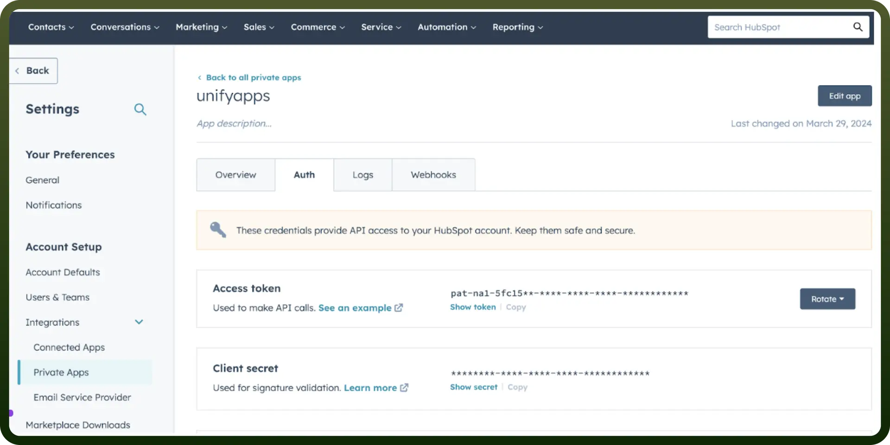

# Hubspot connector

Source: https://www.unifyapps.com/docs/unify-integrations/hubspot
Section: integrations

---

HubSpot is an all-in-one inbound marketing, sales, and customer service platform designed to help businesses grow by attracting, engaging, and delighting customers. It offers tools for CRM, content management, email marketing, lead generation, and analytics to optimize marketing strategies.

Integrating your application with HubSpot amplifies customer relationship management, empowering seamless lead tracking, communication, and automation.

## Authentication

Ensure you have the following information ready for a seamless integration process:

- `Connection Name`**:** Select a descriptive name for your connection, like "MyAppHubspotIntegration". This helps in easily identifying the connection within your application or integration settings.
- `Authentication Type`**:** Hubspot.com supports API tokens for authentication. This method ensures secure access to Hubspot.com's functionalities and data.

### Access Token Based Authentication

- Click on the setting icon in the top right corner of your Hubspot.com account.
- Select "`Admin`" to go to the administration section. **Note:** Only users with admin access can take actions in the administration section.
- Navigate to the "`Private Apps`" section under "`Integrations`".
- Use the existing private app if exists or Click on “`create a private app`” to create a new private app.
  - Fill in the basic information and the scope for your private app. Scopes determine what your app can access and do in HubSpot.
  - Click on create app after filling the above information.
- Click on your private app and navigate to the Auth section.
- In the "`Auth`" section, Create or copy your existing API token.

  

## Actions

| Actions | Description |
|---|---|
| `Add contact to workflow` | Adds a contact to a predefined workflow in HubSpot |
| `Associate records with label` | Associates records with label in Hubspot |
| `Associate records without label` | Associates records without label in Hubspot |
| `Create a new export` | Creates a new export in HubSpot |
| `Create companies` | Creates a batch of companies in HubSpot |
| `Create company` | Create a company in HubSpot |
| `Create contact` | Create a contact in HubSpot |
| `Create contacts` | Creates a batch of new contacts in HubSpot |
| `Create deal` | Create a deal in HubSpot |
| `Create deals` | Creates a batch of new deals in HubSpot |
| `Create engagement` | Creates engagement in HubSpot |
| `Create form submission` | Creates a form submission in HubSpot |
| `Create line item` | Create a line item in HubSpot |
| `Create line items` | Creates a batch of new line items in HubSpot |
| `Create product` | Creates a new product in HubSpot |
| `Create ticket` | Create a ticket in HubSpot |
| `Create ticket` | Creates a batch of new tickets in HubSpot |
| `Delete batch associations` | Deletes associations for a batch of objects in HubSpot |
| `Delete contact` | Delete contact in HubSpost |
| `Get Contacts at a Company` | Gets contacts of a company from HubSpot |
| `Get all owners` | Gets all owner details |
| `Get associations` | Gets associations from HubSpot |
| `Get company` | Get company in HubSpot |
| `Get contact` | Get contact in HubSpot |
| `Get contact by email address` | Gets a contact by email address from HubSpot |
| `Get contacts in a list` | Gets contacts in a list from HubSpot |
| `Get contacts in contacts list` | Get contacts in contacts list |
| `Get deal` | Get deal in HubSpot |
| `Get file public URL` | Gets a publicly accessible URL of a file from HubSpot |
| `Get line item` | Get line item in HubSpot |
| `Get owner by email` | Gets all details of an owner by email from HubSpot |
| `Get owner details by ID` | Gets all details of an owner by ID from HubSpot |
| `Get pipeline stage details` | Finds and retrieves pipeline stage details of CRM objects from HubSpot |
| `Get product` | Gets a product by it's ID from HubSpot |
| `Get specific email` | Get the details of a specified marketing email in HubSpot |
| `Get ticket` | Get ticket in HubSpot |
| `List all companies` | List all companies from the Hubspot account |
| `List all marketing emails` | Lists all the marketing emails for a Hubspot account |
| `Remove an existing contact from a list` | Removes an existing contact from a list in HubSpot |
| `Remove email subscription` | Removes email subscription in HubSpot |
| `Search for companies by domain` | Searches for companies by domain in HubSpot |
| `Search pipeline stages` | Search pipeline stages in HubSpot |
| `Search records` | Searches for records in HubSpot |
| `Single send email template` | Send template emails created in the HubSpot marketing email tool |
| `Update company` | Updates a batch of companies in HubSpot |
| `Update company` | Update a company in HubSpot |
| `Update contact` | Updates a batch of contacts in HubSpot |
| `Update contact` | Update a contact in HubSpot |
| `Update deal` | Updates a batch of deals in HubSpot |
| `Update deal` | Update a deal in HubSpot |
| `Update line item` | Update a line item in HubSpot |
| `Update line item` | Updates a batch of line items in HubSpot |
| `Update product` | Updates a product in HubSpot |
| `Update product` | Updates a batch of products in HubSpot |
| `Update ticket` | Update a ticket in HubSpot |
| `Update ticket` | Updates a batch of tickets in HubSpot |

## Triggers

| Trigger | Description |
|---|---|
| `Get marketing emails` | Trigger to get marketing emails in HubSpot |
| `New contact in contact list` | Triggers when a contact is added to a specific contact list |
| `New event` | Triggers when a new event occurs in HubSpot |
| `New form submission` | Triggers when a form is submitted |
| `New record` | Triggers when a new record is created in HubSpot |
