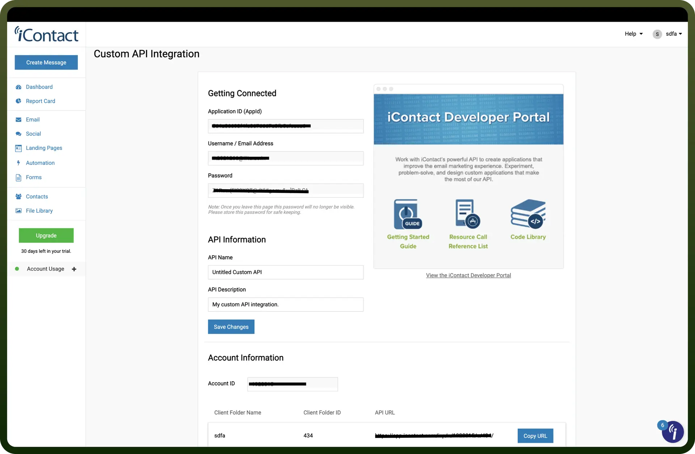

# IContact connector

Source: https://www.unifyapps.com/docs/unify-integrations/icontact
Section: integrations

---

**iContact** is an email marketing platform designed for small to medium-sized businesses. It offers tools for creating, sending, and analyzing email campaigns with automation and list management features.

Integrating iContact streamlines email campaign management, improves audience targeting, and enhances engagement through automation and analytics.

## Authentication

Before you begin, make sure you have the following information:

- `Connection Name`: Select a descriptive name for your connection, like "MyAppiContactIntegration". This helps in easily identifying the connection within your application or integration settings.
- `Authentication Type`**:** iContact supports Basic Authentication for authentication.

### Basic Authentication

- Go to '`Settings and Billing`' → '`iContact Integrations`'.
- Click '`Create under Custom API Integrations`'.
- Get your '`API Application ID`', '`Username`', '`Password`'.
- Enter an '`API Name`' & '`Description`' and click '`Save`'.
- Store these securely as they provide access to your iContact account.

  

## Actions

| Actions | Description |
|---|---|
| `Contact subscribed` | Subscribes a contact to a given list |
| `Create contact` | Creates a new contact in your account |
| `Create message` | Creates a new message |
| `Create sender property` | Creates a new sender property |
| `Find contact` | Find contact by search field |
| `Find sender property` | Find sender property by search field |
| `Send HTML message` | Send a new message from custom HTML |
| `Unsubscribe contact` | Unsubscribe a contact from a given list |
| `Update contact` | Updates a contact |

## Triggers

| Triggers | Description |
|---|---|
| `Contact subscribed` | Triggers when a contact subscribes |
| `Contact unsubscribed` | Triggers when a contact unsubscribes |
| `Contact updated` | Triggers when a contact is updated |
| `New Contact in List` | Triggers when a new contact is created in the given iContact list |
| `New Message Created (Polling)` | Triggers when a new message is created |
| `New contact` | Triggers when a contact is created |
| `New list` | Triggers when a new list is created in iContact |
| `New sender property` | Triggers when a new sender property is created |
