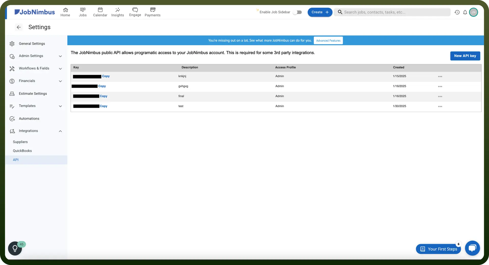

# JobNimbus connector

Source: https://www.unifyapps.com/docs/unify-integrations/jobnimbus
Section: integrations

---

JobNimbus is a CRM and project management software designed for contractors, helping streamline scheduling, estimates, invoicing, and job tracking. It offers automation, integrations, and mobile access to improve efficiency and organization.

Integrating your application with JobNimbus allows you to manage leads, track jobs, and streamline your workflow processes efficiently.

## Authentication

Before you begin, make sure you have the following information:

- `Connection Name`**:** Select a descriptive name for your connection, like "MyAppJobNimbusIntegration". This helps in easily identifying the connection within your application or integration settings.
- `Authentication Type`**:** JobNimbus supports Bearer Token authentication. This method ensures secure access to JobNimbus's functionalities and data.

### Bearer Token Based Authentication

- Log into your JobNimbus account and navigate to the Settings section from the menu.
- In the "`API`" tab, you will find your API Key.
- If an API Key is not generated yet, click on "`New API Key`" to create one.
- Copy the API Key and keep it secure, as it grants access to your JobNimbus account.

  

## Actions

| Actions | Description |
|---|---|
| `Contact Created or Updated` | Triggers when a new contact is created or updated in JobNimbus |
| `Contact Deleted` | Triggers when a new contact is deleted in JobNimbus |
| `Job Created or Updated` | Triggers when a new job is created or updated in JobNimbus |
| `Job Deleted` | Triggers when a new job is deleted in JobNimbus |

## Triggers

| Triggers | Description |
|---|---|
| `Create Attachment` | Creates a new attachment in JobNimbus |
| `Create Contact` | Creates a new contact with a display name in JobNimbus |
| `Create Job` | Creates a new job in JobNimbus |
| `Find Contact by ID` | Searches for a JobNimbus contact by ID in JobNimbus |
| `Update Contact` | Updates an existing contact in JobNimbus |
